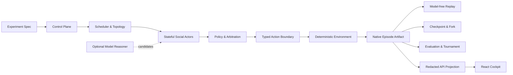

# Werewolf Multi-Agent Social Harness

[](https://github.com/multi-zhangyang/werewolf-multi-agent-social-harness/actions/workflows/validate.yml)


[](LICENSE)

**Replayable, forkable and evaluable infrastructure for multi-agent adversarial societies.**

Werewolf Multi-Agent Social Harness 是一个面向隐藏信息、社会博弈和 Agent 评测的
实验运行时。它负责调度有状态 Actor、约束观察与通信范围、校验类型化动作、提交
确定性环境转换，并把完整过程保存为可审计、可重放、可分叉和可聚合的实验工件。

狼人杀是第一个领域适配器，也是对欺骗、联盟、说服、信任、背叛和信息不对称的
压力测试场景。核心 Harness 不依赖狼人杀规则，可继续接入其他社会模拟与对抗环境。

<p align="center">
  <a href="#快速开始">快速开始</a> ·
  <a href="#核心能力">核心能力</a> ·
  <a href="#系统架构">系统架构</a> ·
  <a href="#运行实验">运行实验</a> ·
  <a href="#http-api">HTTP API</a> ·
  <a href="docs/architecture.md">架构文档</a> ·
  <a href="CONTRIBUTING.md">参与贡献</a>
</p>

## 为什么需要 Harness

让多个模型会话互相发送文本，并不足以构成可靠的多 Agent 实验。一个可研究、
可回归、可比较的社会运行时，还必须回答这些问题：

- 每个 Agent 在某一时刻究竟看到了什么？
- 消息通过哪个 channel 发送，哪些 Actor 有权接收？
- 模型提出的动作是否合法，谁拥有最终状态转换权？
- Agent 的记忆、belief、关系、承诺和目标如何跨回合演化？
- 一次失败、超时、截断或 provider 重试如何进入实验记录？
- 相同工件能否在不再次调用模型的情况下重放？
- 一个 checkpoint 分叉后，如何证明它来自哪条执行谱系？
- 指标能否引用具体步骤、消息、receipt 和状态证据？

本项目把这些职责放进 Harness，而不是交给 prompt、模型输出或浏览器状态。

| 组成 | 职责边界 |
| --- | --- |
| **Agent** | 持久身份、profile、私有状态、记忆、belief、关系、声誉、规范、目标、策略和动作仲裁 |
| **Reasoner** | Agent 内部可选的模型组件，用于提出发言、反思、证据摘要或动作候选 |
| **Harness** | 实验控制、调度、可见性、通信、合法性、工件、重放、checkpoint/fork 和评测 |
| **Environment** | 验证类型化命令并提交确定性状态转换，是领域状态的唯一权威 |
| **Domain adapter** | 将具体环境映射为通用观察、动作、消息、checkpoint、投影和 evaluator 合同 |
| **React Cockpit** | 读取服务端工件与安全投影，提供运行、复盘、证据和评测界面 |

大语言模型可以参与推理与表达，但不能直接修改环境、决定可见范围、伪造 receipt，
也不能替代重放与评测权威。结构化 JSON 是工程编码，不是 Agent 的定义。

## 核心能力

| 能力 | 实现 |
| --- | --- |
| **有状态社会 Actor** | 持久化 memory、belief、relationship、reputation、norm、commitment、coalition、goal 与 receipt-backed reflection |
| **作用域观察与通信** | Harness 管理 public、team、private channel、投递 receipt、不可变 audience 与 exposure evidence |
| **类型化动作边界** | Policy 与 reasoner 只能提出候选；仲裁器和环境共同执行合法性检查 |
| **确定性环境权威** | 领域引擎独立于模型和 UI，固定 seed 下的转换、终局与状态 hash 可验证 |
| **原生执行工件** | 系统步骤和 Actor 步骤记录前后 hash、提交状态、消息范围、receipt、错误与证据引用 |
| **无模型重放** | Replay 只消费已经提交的原生步骤，不调用 Agent、reasoner 或 provider |
| **Checkpoint 与 Fork** | 从已验证边界恢复分支，保留父工件、checkpoint 与重新执行谱系 |
| **评测与锦标赛** | Evaluator registry、证据化指标、失败保留、生命周期分母、leaderboard 和矩阵实验 |
| **安全发布投影** | 区分 canonical authority、赛后脱敏视图与可分享的 truth-redacted 工件 |
| **统一操作界面** | React Cockpit 覆盖运行、时间线、领域复盘、社会证据、谱系、评测、矩阵、对比和公开包 |

## Cockpit

Cockpit 是 Harness 工件的操作与分析界面。它不会在浏览器里维护另一套隐藏角色、
私有观察或胜负状态；所有视图都来自服务端记录和显式脱敏投影。项目首页只展示由
完整真实流式运行生成、并经过赛后脱敏的画面；测试 fixture 不作为产品运行或展示材料。

下列画面来自同一场真实流式完整对局的 `postgame-redacted` 服务端投影。该局正常进入
`game_over`，记录 59 个原生步骤、59 个已提交步骤、0 个拒绝步骤和 116 条社会消息；
截图不包含私有观察、reasoner memo、provider 请求标识或凭据。

### 运行注册表与原生执行


### 狼人杀赛后复盘


### 社会证据图


## 快速开始

### 环境要求

- Node.js 22 或更高版本
- npm
- Chromium（仅运行 Playwright E2E 时需要）
- Provider API key（仅运行真实模型 Agent 时需要）

### 安装

```bash
git clone https://github.com/multi-zhangyang/werewolf-multi-agent-social-harness.git
cd werewolf-multi-agent-social-harness
npm ci
```

### 启动本地开发环境

```bash
cp .env.example .env.local
npm run dev
```

- Cockpit：<http://127.0.0.1:5173>
- API：<http://127.0.0.1:8787>
- 健康检查：<http://127.0.0.1:8787/api/health>

`.env.example` 默认不设置 `MATCH_MAX_TRANSITIONS`，因此正常对局会运行到
`completed + game_over`；只有显式填写该变量或传入 `--maxTransitions` 才会进入诊断截断模式。
示例同时配置 match、checkpoint、tournament、experiment 与 comparison 的本地工件目录，
服务重启后仍可恢复已发布的研究工件。

内置服务默认面向本地研究与开发。部署到共享网络前，应增加身份认证、限流、TLS、
存储隔离和经过审计的反向代理，并只开放适合目标受众的脱敏投影接口。

## 系统架构



架构按职责分为九个平面：

1. **Control plane**：实验规格、seed、profile/model assignment、timeout/retry 和运行谱系。
2. **Environment plane**：领域状态、待处理动作、命令合法性、确定性转换与终局。
3. **Observation plane**：私有与公开观察、可见范围、脱敏和“谁在何时知道什么”。
4. **Society plane**：通信拓扑、消息、信任、怀疑、声誉、规范、联盟和冲突证据。
5. **Agent plane**：身份、私有状态、记忆、belief、目标、policy、reasoner 与仲裁。
6. **Artifact plane**：trajectory、原生步骤、checkpoint、fork、失败记录与发布投影。
7. **Evaluation plane**：指标注册、evidence refs、聚合、锦标赛和 leaderboard。
8. **API/server plane**：运行入口、工件读取、重放、分叉、配置摘要与安全投影。
9. **React cockpit plane**：消费 Harness 真相的交互界面，不生成独立隐藏真相。

深入阅读：

- [系统架构与权威边界](docs/architecture.md)
- [社会 Harness、Agent scaffold 与通信合同](docs/social-harness.md)
- [相关系统研究与架构取舍](docs/harness-research.md)
- [多 Agent 社会能力路线图](docs/multi-agent-society-harness-plan.md)

## 模型 Provider

运行时支持三种协议适配器：

| 协议 | Endpoint 变量 | 说明 |
| --- | --- | --- |
| `openai-chat-completions` | `LLM_CHAT_COMPLETIONS_URL` | OpenAI-compatible messages 与 SSE stream |
| `openai-responses` | `LLM_RESPONSES_URL` | Responses API input/instructions 与 output-text events |
| `anthropic-messages` | `ANTHROPIC_MESSAGES_URL` | Anthropic Messages event stream |

OpenAI-compatible Chat Completions 最小配置：

```dotenv
LLM_PROVIDER_PROTOCOL=openai-chat-completions
LLM_CHAT_COMPLETIONS_URL=https://provider.example/v1/chat/completions
LLM_API_KEY=replace-with-your-key
LLM_MODELS=your-model-id
LLM_STREAM=true
LLM_TIMEOUT_MS=120000
LLM_RETRY_COUNT=2
```

真实运行必须使用流式请求。环境工厂在 `LLM_STREAM=false` 时直接拒绝启动；
OpenAI-compatible Chat Completions 请求不发送 `max_tokens`、
`max_completion_tokens` 或同类输出 token 上限字段。Anthropic Messages 协议本身要求
提供 `max_tokens`，因此通过独立的 `ANTHROPIC_MAX_TOKENS` 配置处理。

Provider 瞬时重试始终保持原模型，不会静默切换模型或伪造本地 fallback。请勿提交
`.env`、`.env.local`、API key、原始 provider payload 或未经脱敏的完整实验工件。

## 运行实验

### 单回合探测

```bash
npm run agent:probe -- --models=your-model-id --timeout=90s
```

### 完整多 Agent 对局

```bash
mkdir -p artifacts
npm run arena:match -- \
  --models=your-model-id \
  --timeout=90m \
  --json=summary \
  --export=artifacts/match.json
```

只有 `completed + game_over` 且没有 Harness failure 的对局才返回成功。显式设置
`--maxTransitions` 可用于诊断，但达到上限的 `truncated` 工件不会计作完整真实运行，
CLI 也会以非零状态退出。

需要快速验证接口而不等待完整对局时，请明确使用诊断命令：

```bash
npm run arena:match -- \
  --models=your-model-id \
  --maxTransitions=4 \
  --timeout=3m \
  --json=summary
```

该命令预期产生 `truncated` 生命周期，只用于诊断，不是完整真实模型验收。

### 锦标赛

```bash
npm run arena:tournament -- \
  --spec=experiments/wolf-vs-village.json \
  --json=summary
```

示例规格中的模型 ID 是占位值。运行前请在实验规格或 CLI profile 覆盖中替换为
Provider 实际支持的模型。

### 实验矩阵

```bash
npm run arena:matrix -- \
  --spec=experiments/matrix-smoke.json \
  --outputDir=artifacts/matrix-smoke
```

### 无模型重放

```bash
npm run arena:replay -- \
  --artifact=artifacts/match.json \
  --json=summary
```

实验规格由 Harness 统一规范化。CLI 参数覆盖规格文件，规格文件覆盖环境默认值；
profile 与 assignment policy 明确绑定模型、策略、座位、角色和阵营。更多可执行输入见
[experiments](experiments/)。

## 狼人杀领域适配器

`classic-9-seat-v1` 是确定性、版本化的验证规则集，覆盖：

- 九人隐藏角色与阵营信息；
- 狼人团队通信和夜间击杀；
- 预言家查验、女巫解药/毒药、猎人开枪；
- 白天公开发言、放逐投票、可选警长竞选与遗言；
- 合法目标、死亡结算、阶段推进和胜负判定；
- 领域 evaluator、公开投影与 React 复盘视图。

Prompt 和 UI 不能修改领域规则。不同桌规需要新的版本化合同，避免把实验语义藏进
模型提示词或浏览器分支。

## 第二领域：密封竞价

`sealed-bid-auction` 证明通用 Harness 并不依赖狼人杀。它复用同一套并行调度、
作用域观察、类型化命令、原子环境提交、社会消息、原生工件、checkpoint、fork、
无模型 replay、experiment orchestration 和 evaluator registry：

```bash
npm run arena:auction -- \
  --seed=auction-example \
  --output=artifacts/sealed-bid-auction
```

该领域使用明确标记的 `policy-only` Actor，不创建 provider client，输出
`providerCalls: 0`，因此不会冒充真实模型验证。完整接入说明见
[密封竞价领域适配器](docs/sealed-bid-auction-domain.md)。

## 工件、重放与可见性

`socialEpisode.steps` 是原生执行权威；兼容性的 `trajectory` 投影不能重建缺失的
system step 或 rejected step。

| 视图 | 用途 |
| --- | --- |
| `postgame-redacted` | 本地研究与复盘；移除私有观察和 reasoner 内容 |
| `truth-redacted` | 公开分享；继续移除赛后真相和私有证据 |
| `full` | 本地 operator 调试与 canonical authority |

完整工件可能含有隐藏角色、分级观察、Agent 私有状态和社会证据，应按敏感实验数据
处理。公开投影是绑定 canonical artifact hash 的派生 sidecar，不是 replay 或
checkpoint authority。

Replay 按已记录的转换执行，不调用 provider。Fork 从已验证 checkpoint 恢复，
创建新的执行谱系，并可以重新调用 Agent 生成反事实分支。

## HTTP API

Express 服务与 CLI 共用同一套 Harness、工件、重放和评测实现。

| Method | Endpoint | 用途 |
| --- | --- | --- |
| `GET` | `/api/config` | 安全运行时摘要与 capabilities |
| `POST` | `/api/harness/probe` | 有界 provider-backed Harness 回合 |
| `POST` | `/api/matches/run` | 运行对局并记录原生工件 |
| `GET` | `/api/matches/:id/artifact` | 读取指定脱敏视图 |
| `POST` | `/api/matches/:id/replay` | 校验无模型重放 |
| `POST` | `/api/matches/:id/checkpoints` | 在原生步骤边界创建 checkpoint |
| `POST` | `/api/checkpoints/:id/fork` | 从 canonical checkpoint 创建分支 |
| `POST` | `/api/tournaments/run` | 运行完整生命周期锦标赛 |
| `POST` | `/api/experiments/matrix/run` | 执行锦标赛 cell 矩阵 |

完整工件和 operator capability 只适用于受信任的本地边界；公开调用方应只访问经过
授权的脱敏投影与分享路由。

## 开发与质量门禁

```bash
npm run typecheck  # TypeScript 合同检查
npm test           # 确定性单元与集成测试
npm run build      # 类型检查、production build 与 bundle budget
npm run test:e2e   # Playwright Cockpit E2E
npm run ci         # 完整本地验证链
```

CI 在 Node.js 22 上执行类型检查、Vitest、production build 和 Chromium E2E。
真实 provider 验证与确定性测试分离，避免把网络波动或凭据依赖伪装成核心回归测试。

当前发布基线已通过 57 个 Vitest 文件中的 638 项测试、24 项 Playwright 桌面/移动端
与无障碍测试、production build 和 bundle budget。额外的真实验收局使用通用
OpenAI-compatible 流式通道完成 58 次 reasoner 调用，最终为
`completed + game_over`、0 Harness error；随后 59 个原生步骤在零模型调用下重放，
最终状态 hash 与消息 hash 均与 canonical 工件一致。

### 仓库结构

```text
src/harness/              通用编排、社会 Actor、工件、重放与评测
src/core/                 确定性狼人杀引擎与版本化规则
src/agents/               模型 Provider 协议适配器
src/server/               Express API、Store 与安全投影
src/components/cockpit/   React 操作与分析工作区
experiments/              可执行实验规格
tests/                    Vitest 单元与集成测试
e2e/                      Playwright 浏览器回归与本地测试资产
docs/                     架构、研究和设计文档
```

主要技术栈：TypeScript、React、Ant Design、Vite、Express、Vitest 和 Playwright。
项目当前以源码形式提供，尚未作为 npm package 发布。

## 参与贡献

欢迎通过 [GitHub Issues](https://github.com/multi-zhangyang/werewolf-multi-agent-social-harness/issues)
提交功能建议和缺陷报告。准备代码变更前，请先阅读 [CONTRIBUTING.md](CONTRIBUTING.md)
以及对应的架构文档，确认修改所属的 Harness plane 和现有合同。

安全问题请按照 [SECURITY.md](SECURITY.md) 私下报告，不要在公开 Issue 中发布凭据、
私有工件或漏洞利用细节。

## License

[Apache License 2.0](LICENSE)。允许在遵守许可证条款的前提下使用、修改和分发，
并包含明确的贡献者专利授权。
