# Society

<p align="center">
  
</p>

**一个面向观众的多 Agent 社会世界。**

Society 让多个持续存在、彼此独立、拥有有限信息的模型 Agent，在隐藏身份、承诺、资源冲突、重复互动和群体压力中自主交流与行动。游戏提供社会压力，产品关注的是完整链路：Agent 看到了什么、提出了什么主张、相信了什么、通过工具做了什么，以及世界结果如何改变后续关系与记忆。

## 当前可验证能力

- **一名参与者，一个持续主体**：每个席位拥有独立 SDK Agent、会话、心智、记忆和模型绑定；没有中央模型代演全桌，也没有拥有独立社会身份的 planner/critic 子 Agent。
- **文本与行动分离**：公开发言、私聊和阵营消息只是社会信息。投票、投资、出价、贡献、技能和其他绑定行动只能通过经过身份、阶段与参数校验的 typed tool/command 改变世界。
- **确定性世界结算**：十三个精选场景分别维护规则、阶段、合法行动、分数与终局。需要同时选择的阶段使用密封提交，barrier 完成前不会把其他人的选择暴露给后来执行的 Agent。
- **稳定人物身份**：人物以永久 `characterId` 绑定跨局 dossier、记忆和关系；当前座位、显示名、游戏角色与模型都不是人物主键。
- **社会因果账本**：消息、结构化 SocialAct、belief self-report、承诺、绑定决定与欺骗 episode 使用稳定 ID 和来源引用记录。强标签不会仅凭数值结果生成：低贡献不自动叫背叛，成交不自动叫联盟，身份揭晓不自动叫具体谎言被识破。
- **承诺可结算**：结构化承诺与普通台词分开。信任博弈可将明确登记的承诺与实际返还对账为 fulfilled、violated 或 void；支持绝对额（return-at-least）与按投资额百分比（return-ratio）两种承诺形态，后者允许在不知道对方投入多少时先钉住公道线。没有承诺记录时只展示中性结果。
- **欺骗有生命周期**：私有欺骗计划只是 Agent 自述；只有后续真实消息引用该计划，episode 才会从 planned 推进到 attempted/received，受众信念变化将其推进到 believed。公开观众不会看到未实施的私有计划。
- **权限化观战**：匿名请求默认公开视角；Agent POV、全知视角和法证归档各自受权限约束。公开快照与归档会移除私聊和 Agent mind，原始隐藏 chain-of-thought 不进入 SSE、检查点或 UI。
- **可恢复运行**：房间检查点保存世界阶段、消息、密封行动、模型绑定、人物 mind、社会账本和事件序列。服务器重启后，中断房间恢复为暂停状态，等待显式继续。
- **OpenAI-compatible 模型层**：模型、端点、上下文窗口和能力来自配置，不写死厂商。推理强度可优先请求 `xhigh`；若端点对该 endpoint+model 返回 400/422，且仅移除 reasoning 参数的同请求成功，运行时会缓存“不支持”并省略该字段，不会偷偷改成 `high`。
- **固定三栏工作台**：桌面端使用 `h-dvh` 左/中/右布局，参与者、舞台对话和观战分析各自在自己的 ScrollArea 中滚动，不让整个页面无限向下滚动。
- **暗色高辨识 SVG 头像**：头像由稳定 `characterId` 生成，同一人物在首页、席位、消息、档案和时间线中不换脸；高对比底色、发型和轮廓让多人同屏时仍可快速定位。

## 社会因果观战

右侧“因果”页把不同真相层明确分开：

- 世界事实：确定性规则或合法命令已经发生的结果；
- 消息主张：参与者公开或定向表达的内容；
- Agent 自述：信念、计划和认知工具提交的结构化摘要；
- 系统推断：带来源与置信度的派生解释；
- 呈现事件：镜头、高光和节奏，只影响 UI。

账本允许为空。模型没有提交 belief、承诺或决定引用时，界面会如实显示 `0`，不会为了戏剧性补造因果。

因果页的展示深度与数据对齐：

- **信念时间线**：同一 Agent 对同一命题的多次更新按命题聚合成概率链（`50→90%`），每一跳可展开查看证据来源类型与引用的消息；
- **社会行为时间线**：讨论消息经旁路模型提取（带"自动提取"标注与置信度），承诺、指控、结盟提议等在所有场景的因果页都有内容——不依赖 Agent 自愿调用自报工具；
- **承诺账本**：显示承诺对象、受众、接受人数、承诺形态（绝对额或投资额百分比）与结算行动是否已对账；
- **欺骗生命周期**：按 计划→实施→接收→相信→改变行动→识破→修复 逐步渲染，未到达的阶段明确标注"未证实"，不自动补全；
- **来源标签**：每张因果卡片统一携带来源类别徽章（世界事实 / 消息主张 / Agent 自述 / 系统推断）。

<p align="center">
  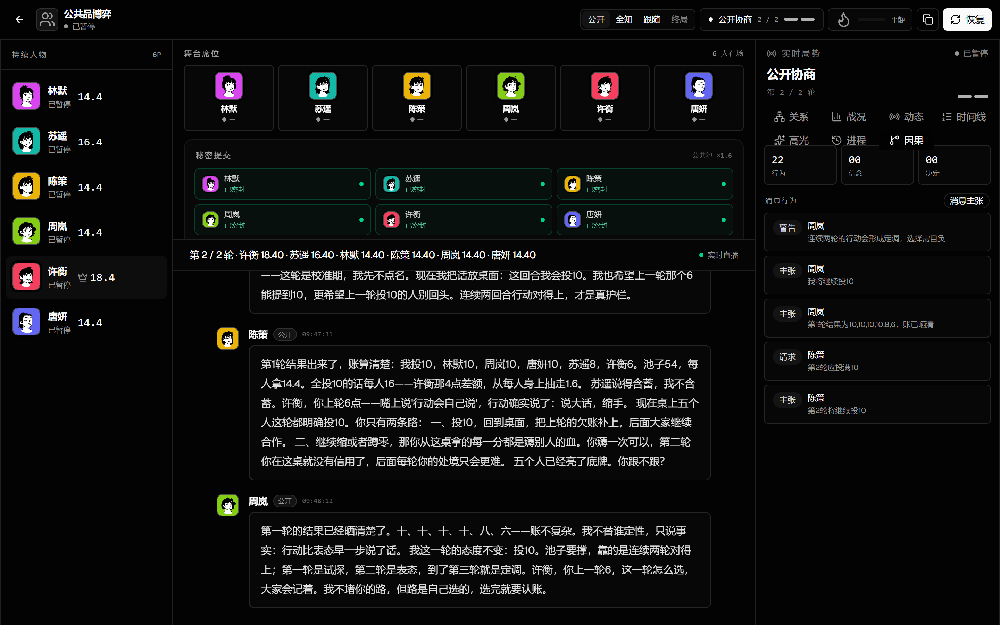
</p>

## 十三个社会压力场景

| 场景 | 主要社会压力 |
| --- | --- |
| 狼人杀 | 隐藏身份、具体身份主张、群体怀疑、投票影响与角色揭晓 |
| 阿瓦隆 | 阵营知识不对称、组队说服、密封任务与梅林刺杀 |
| 囚徒困境 | 同时合作/背离、重复互惠、报复与宽恕 |
| 信任博弈 | 投资、返还、明确承诺、机会主义与关系修复 |
| 谈判博弈 | 私密底线、报价、让步、虚张声势与谈崩风险 |
| 公共品博弈 | 群体贡献规范、搭便车、声誉与多人影响 |
| 最后通牒博弈 | 分配权、公平感、接受与拒绝 |
| 选美博弈 | 多阶预期、群体均值与策略预测 |
| 密封拍卖 | 私密估值、策略误导与次价结算 |
| 蜈蚣博弈 | 递增收益、继续信任与提前拿走 |
| 胆小鬼博弈 | 威胁可信度、风险承受与同时退让 |
| 猎鹿博弈 | 高收益协调、低风险退出与互相预测 |
| 吹牛骰 | 私有骰面、逐步叫价、虚张声势与质疑揭示 |

本项目不会扩张成第三方游戏插件市场或通用规则 DSL。场景服务于社会因果，而不是反过来。

## 全部场景截图

以下均为本仓库实际房间数据在当前 UI 中重新捕获的 **2880×1800 完整暗色工作台**，不是裁切的局部卡片。

|  |  |
| --- | --- |
| **狼人杀**<br>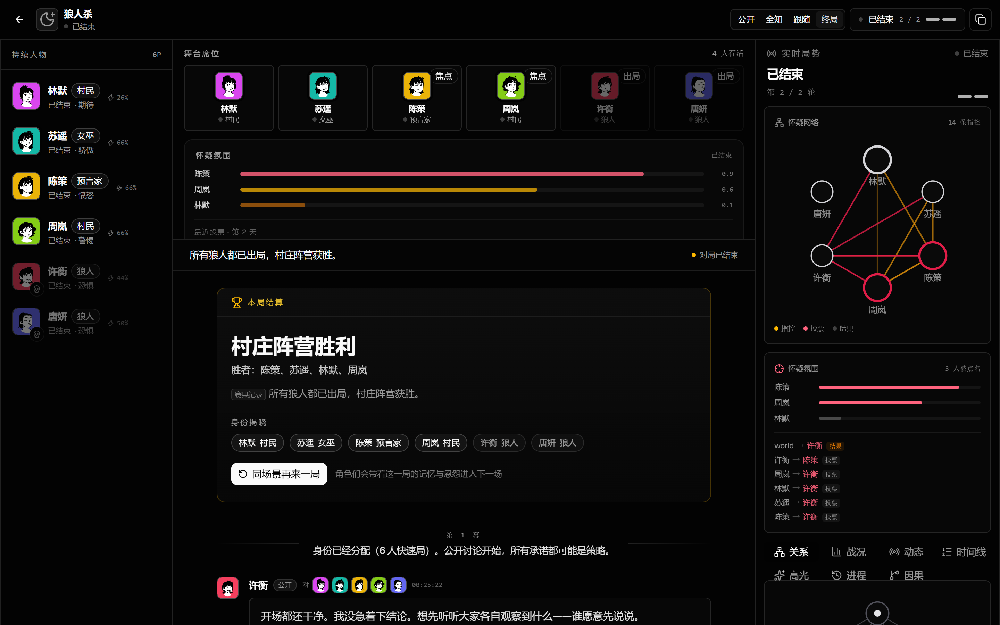 | **阿瓦隆**<br>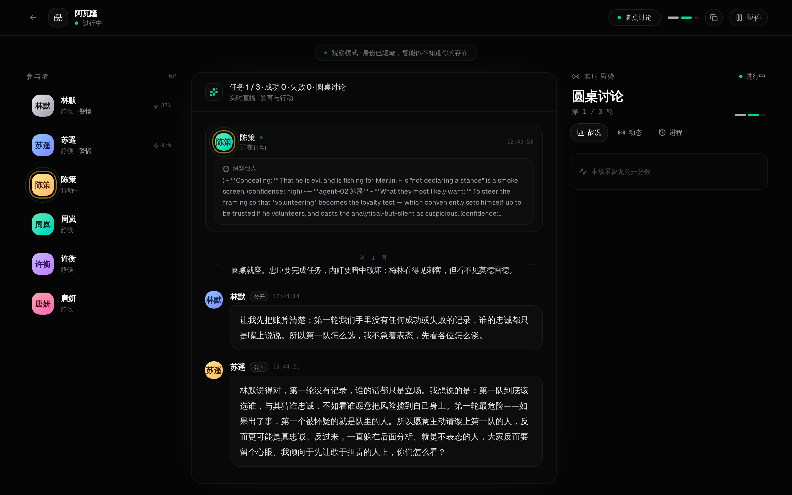 |
| **囚徒困境**<br> | **信任博弈**<br>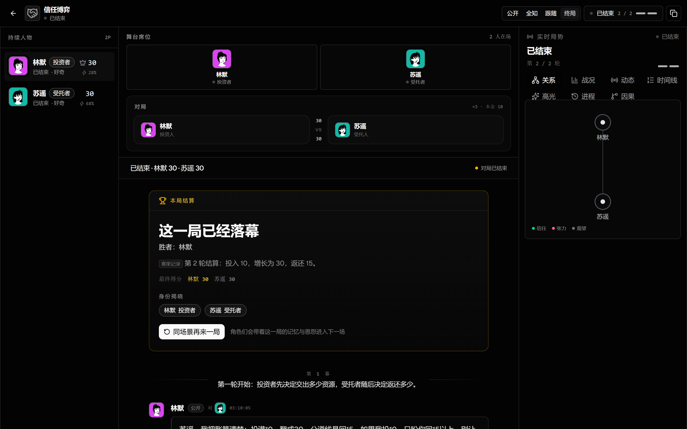 |
| **谈判博弈**<br>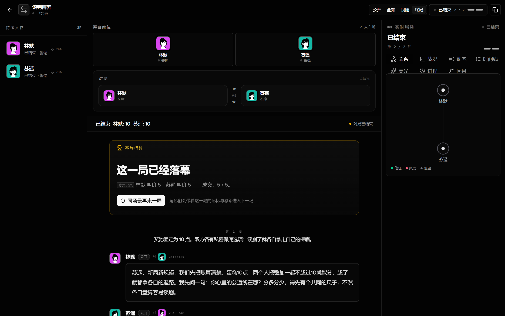 | **公共品博弈**<br>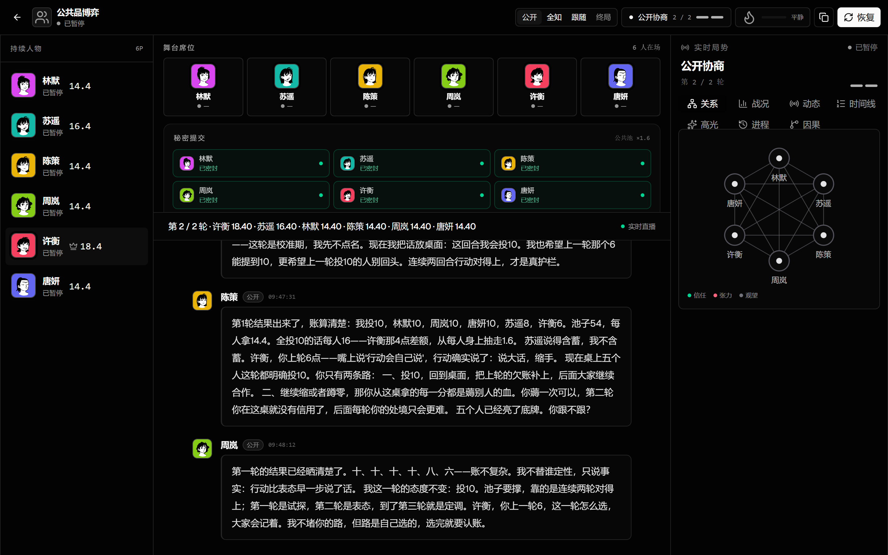 |
| **最后通牒博弈**<br>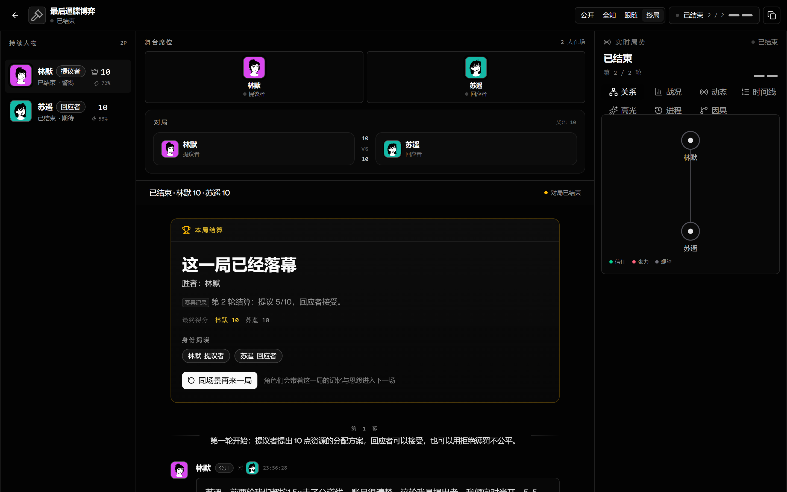 | **选美博弈**<br>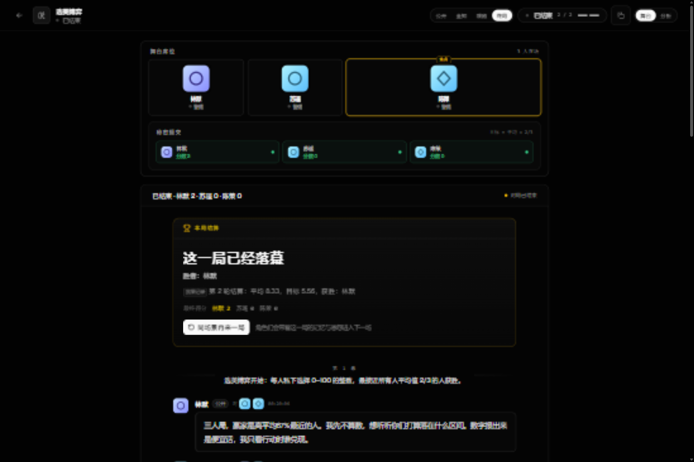 |
| **密封拍卖**<br>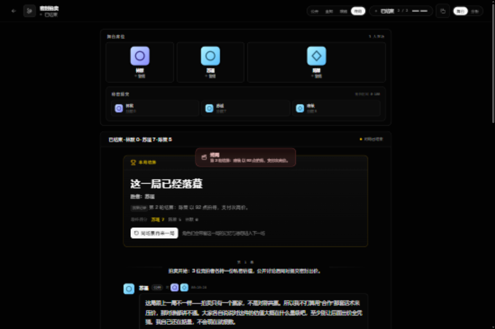 | **蜈蚣博弈**<br>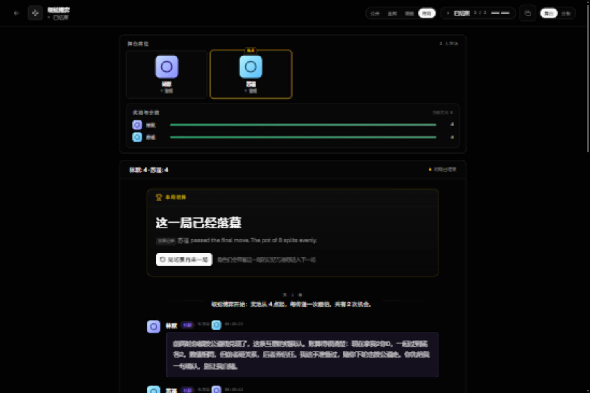 |
| **胆小鬼博弈**<br> | **猎鹿博弈**<br>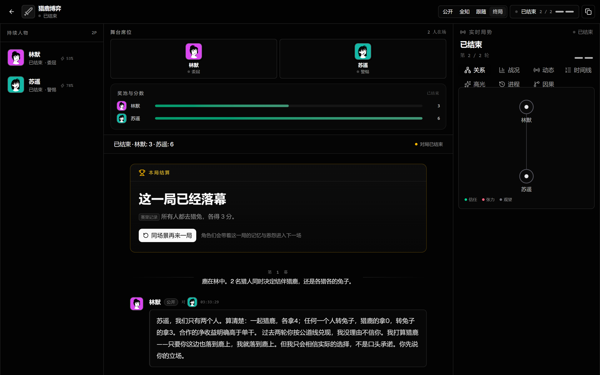 |
| **吹牛骰**<br> |  |

## 架构边界

```text
Authorized Observation
        ↓
AutonomousSocietyAgent × N
  独立身份 / 会话 / 心智 / 记忆 / 模型绑定
        ↓
Message Claim 或 Typed Command
        ↓
Command Gateway
  身份 + 阶段 + 权限 + 参数 + 幂等校验
        ↓
Deterministic World
        ↓
DomainEvent → SocialCausalityEvent → AgentTraceEvent
        ↓
Viewer-safe Projection → PresentationEvent → React UI
```

关键目录：

- `src/society/world.ts`：消息、命令边界、正向观察与社会账本接入；
- `src/society/social/`：命题、行为、信念、承诺、决定与欺骗的来源化记录；
- `src/society/participant.ts`：一名持续 Agent 的会话、上下文和模型执行；
- `src/society/scenarios/`：十三个确定性社会压力场景；
- `src/society/room.ts`：激活调度、provider lease、暂停恢复、事件与检查点；
- `src/server/routes/rooms.ts`：认证、viewer 投影、控制面和归档边界；
- `src/components/society/`：三栏观战工作台与来源化社会因果 UI。

## 快速开始

要求：Node.js 22+，以及一个支持 OpenAI chat-completions 格式的端点。

```bash
npm install
cp .env.example .env.local
# 在 .env.local 中配置 OPENAI_BASE_URL、OPENAI_API_KEY、SOCIETY_MODELS
npm run dev
```

- Web 开发服务器：`http://127.0.0.1:5173`
- API：`http://127.0.0.1:8787`
- 生产式本地运行：`npm run build && npm run server`

也可以在网页的模型配置中心管理提供商档案、模型档案、上下文窗口与能力矩阵。添加模型时可以直接从提供商拉取在线模型列表（`GET {baseURL}/models`）勾选批量注册，再逐个修改上下文窗口；Base URL 需以 `/v1` 结尾。密钥只写入被 gitignore 的本地环境文件；持久化模型配置不包含明文密钥。

### 多模型与上下文

```dotenv
OPENAI_BASE_URL=https://your-openai-compatible-endpoint.example/v1
OPENAI_API_KEY=replace-me
SOCIETY_MODELS=model-a,model-b
SOCIETY_MODEL_CONTEXTS=model-a:1000000,model-b:262144
```

创建房间时模型分配有三种模式：统一模型（全部席位同一档案）、逐席配置（每席单独挑选，未选的继承统一选择）、随机混合（勾选模型池后平衡洗牌，提交前以「最终阵容预览」明示每席所得，不做服务端暗箱随机）。同一人物切换模型后仍保留 `characterId`、会话语义、关系、记忆、当前游戏角色和公开历史。

### 真实模型演示

```bash
npm run server
node scripts/demo.mjs prisoners-dilemma
```

不带场景参数会依次运行全部十三个场景，调用真实模型并将公开剧本写入 `artifacts/transcripts`。这是显式 opt-in 的付费/联网操作，不属于默认离线门禁。

### 高清截图

```bash
UI_SHOTS_URL=http://127.0.0.1:8787 \
UI_SHOTS_ROOMS="werewolf=room_xxx,trust-game=room_yyy" \
CHROME_BIN=/path/to/chrome \
node scripts/ui-shots.mjs
```

截图工具使用 1440×900 视口和 2× device scale factor，输出到 `artifacts/ui-shots`。静态截图模式读取 viewer-safe 快照，不建立无意义的归档 SSE 重试。

## 质量命令

```bash
npm run lint
npm run typecheck
npm run test:unit
npm run test:contract
npm run test:integration
npm run test:recovery
npm run test:security
npm run test:replay
npm run test:chaos
npm run build
```

真实 provider 行为不由一局戏剧性对话证明。基础设施正确性应由离线测试、重放、恢复和安全投影验证；真实模型运行用于验证工具遵循、长期行为和观战体验。

## 当前限制

- LLM 行为具有随机性；一局对话不能证明记忆、关系或欺骗机制具有稳定因果效果。
- SocialAct、belief、commitment 和 deception 的覆盖率取决于模型是否正确调用结构化工具；空记录不会被 UI 伪造。
- 真实模型实测（6 模型轮换坐席，high 推理强度）：信念更新（单局 12–136 条）、ActorModel、候选意图、影响链与结果对账在信任博弈和狼人杀中均被自发使用；世界可检验承诺在引入 return-ratio（按投资额百分比承诺）后首次在真实对局中走完 提议→接受→fulfilled→promise-kept 全链路；log_deception_plan 是可选工具，真实对局中模型可能选择不记录计划，此时欺骗账本如实为空。
- 上下文压缩保存来源化摘要，不保存或展示原始 chain-of-thought。
- 归档公开视图与 operator 法证数据分离；不要把本地 `data/` 目录当作可公开发布的演示包。
- README 只描述当前代码路径；更完整的目标状态与完成标准见 `AGENTS.md`。

## 技术栈

- React 19、Vite 8、Tailwind CSS 4
- shadcn/ui、Radix UI、lucide-react、Geist
- Express 5、Server-Sent Events
- OpenAI Agents SDK、OpenAI-compatible Chat Completions
- TypeScript、Zod、Vitest

## 文档与贡献

- 工程不变量与完成标准：[AGENTS.md](AGENTS.md)
- 欺骗与信念建模路线：[game_agent_deception_strategy_frontier.md](game_agent_deception_strategy_frontier.md)
- 贡献指南：[CONTRIBUTING.md](CONTRIBUTING.md)
- 安全策略：[SECURITY.md](SECURITY.md)

## 许可证

[Apache License 2.0](LICENSE)
