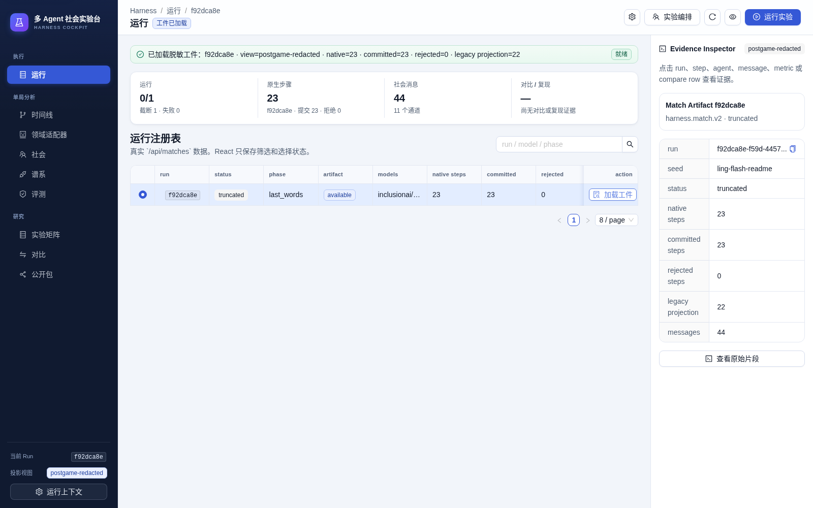
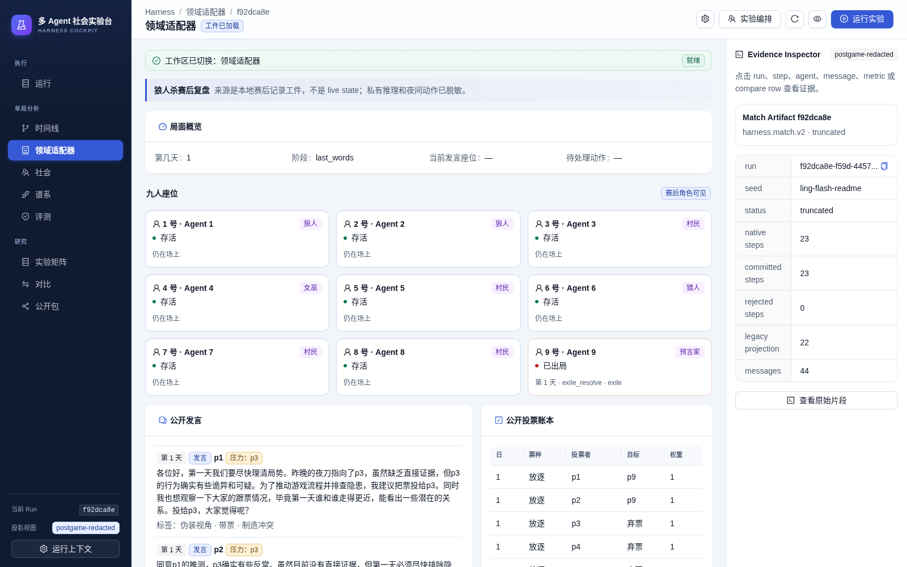
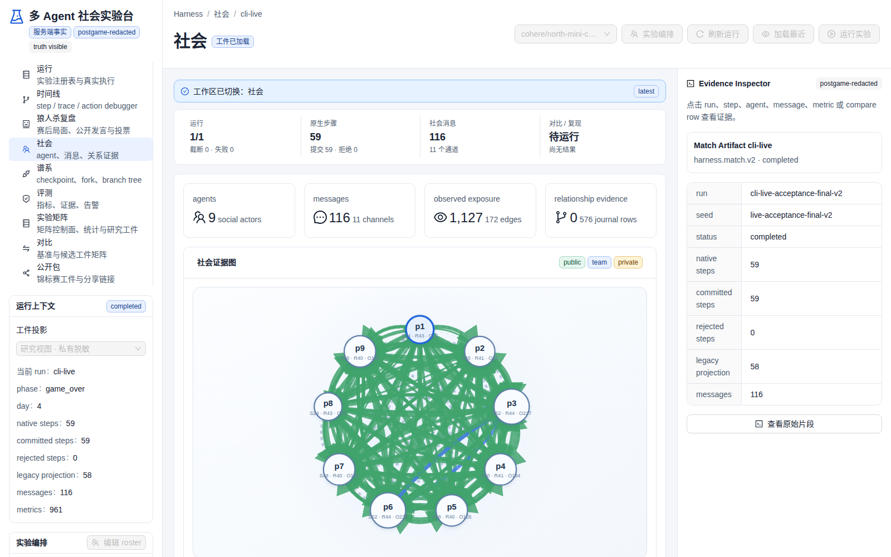
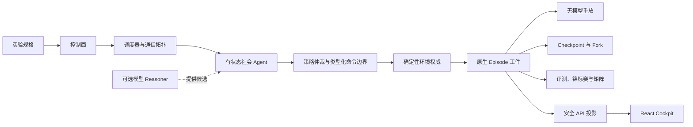

# Werewolf Multi-Agent Social Harness

[](https://github.com/multi-zhangyang/werewolf-multi-agent-social-harness/actions/workflows/validate.yml)


[](LICENSE)

一个可重放、可评测、可分叉的多 Agent 对抗社会运行时。它统一管理有状态
Agent、隐藏信息、分级通信、合法动作、确定性环境转换、运行工件、重放、
checkpoint、fork、评测与锦标赛。

狼人杀是第一个高压领域适配器，React Cockpit 是运行和分析界面。大语言模型
只是 Agent 内部可选的推理与表达组件，不是 Agent 本身，也不是调度器或环境
事实来源。

<p align="center">
  
</p>

<p align="center">
  <a href="#快速开始">快速开始</a> ·
  <a href="#系统架构">系统架构</a> ·
  <a href="#运行实验">运行实验</a> ·
  <a href="docs/architecture.md">架构参考</a> ·
  <a href="CONTRIBUTING.md">参与贡献</a>
</p>

## 项目定位

许多多 Agent 演示只是让多个模型会话互相发送文本。这不足以支撑受控社会实验、
对抗游戏和可复现评测。

本项目明确拆分不同职责：

| 概念 | 职责 |
| --- | --- |
| **Agent** | 持久身份、profile 与角色分配、私有状态、记忆、belief、关系、声誉、规范、目标、策略、可选 reasoner 与动作仲裁 |
| **Reasoner** | 可选的模型组件，用于提出发言、反思、证据摘要或动作候选 |
| **Harness** | 实验控制、调度、观察范围、通信拓扑、合法性、状态转换权、工件记录、重放、checkpoint/fork 谱系与评测 |
| **领域适配器** | 将具体环境映射为类型化观察、待处理动作、命令、转换、checkpoint、投影和 evaluator |
| **React Cockpit** | 展示服务端记录的工件与安全投影，不成为第二套游戏真相来源 |

系统大量使用结构化记录，但 JSON 只是编码格式，不是 Agent 的定义。

## 核心能力

- **有状态社会 Actor**：Agent 的记忆、belief、信任、怀疑、关系、声誉、
  规范、承诺、联盟、目标和基于 receipt 的反思可以跨回合持久化。
- **严格的信息范围**：Harness 管理 public、team 和 private channel，并记录
  每个 Actor 在什么时间能够观察到什么信息。
- **类型化环境权威**：模型只能提出候选；只有策略仲裁和确定性环境校验才能
  提交状态转换。
- **原生执行工件**：committed、rejected、system、sequential、batched 和
  parallel step 都带有 hash、receipt、message 与 evidence reference。
- **无模型重放**：Replay 只消费已记录的原生步骤，不调用 Agent、策略、
  reasoner 或 provider。
- **Checkpoint 与 Fork 谱系**：经过验证的执行边界可以创建新分支，同时严格
  区分 deterministic replay 与重新执行。
- **规模化评测**：Evaluator registry、生命周期安全指标、锦标赛聚合、实验矩阵
  和执行遥测将结果分母与诊断分母分开。
- **运行驾驶舱**：九个响应式工作区覆盖运行、时间线、狼人杀复盘、社会证据、
  谱系、评测、实验矩阵、对比和公开工件包。

## Cockpit

以下截图由仓库自带的 deterministic fixture server 和 production React build
生成，不包含真实 provider 凭据、私有模型推理或用户数据。

<table>
  <tr>
    <td width="50%">
      
    </td>
    <td width="50%">
      
    </td>
  </tr>
  <tr>
    <td align="center"><strong>狼人杀赛后复盘</strong></td>
    <td align="center"><strong>社会证据图</strong></td>
  </tr>
</table>

Cockpit 只消费服务端脱敏投影，不会在浏览器本地重建隐藏角色、私有观察、胜负、
回放帧或社会信息暴露关系。

## 系统架构



通用 Harness 不需要理解狼人杀角色。狼人杀规则保留在核心引擎和领域适配器中，
持久化、重放、评测编排和发布合同保持可复用。

详细设计文档：

- [系统架构](docs/architecture.md)
- [社会 Harness](docs/social-harness.md)
- [Harness 技术研究](docs/harness-research.md)
- [多 Agent 社会演进计划](docs/multi-agent-society-harness-plan.md)

## 快速开始

### 环境要求

- Node.js 22 或更高版本
- npm
- 仅在运行真实模型 Agent 时需要 provider API key

### 安装与启动

```bash
git clone https://github.com/multi-zhangyang/werewolf-multi-agent-social-harness.git
cd werewolf-multi-agent-social-harness
npm ci
cp .env.example .env.local
npm run dev
```

默认服务只监听本机：

- React Cockpit：<http://127.0.0.1:5173>
- Express API：<http://127.0.0.1:8787>

> **部署边界**
>
> 内置服务面向本地研究与开发，不能直接暴露到不可信网络。远程部署必须增加
> 身份认证、限流、经过审计的反向代理、传输加密和存储隔离，并使用脱敏发布
> 路由，而不是完整研究工件接口。

## 模型 Provider 配置

运行时必须显式选择协议。模型 ID 始终是透明传递的配置值，不会选择特殊
parser、prompt、fallback 或动作路径。

最小 OpenAI-compatible Chat Completions 配置：

```dotenv
LLM_PROVIDER_PROTOCOL=openai-chat-completions
LLM_CHAT_COMPLETIONS_URL=https://provider.example/v1/chat/completions
LLM_API_KEY=replace-with-your-key
LLM_MODELS=your-model-id
LLM_STREAM=true
LLM_TIMEOUT_MS=120000
LLM_RETRY_COUNT=2
```

| 协议 | Endpoint 配置 | 说明 |
| --- | --- | --- |
| `openai-chat-completions` | `LLM_CHAT_COMPLETIONS_URL` | OpenAI-compatible messages 与 SSE event |
| `openai-responses` | `LLM_RESPONSES_URL` | Responses API input/instructions 与 output-text event |
| `anthropic-messages` | `ANTHROPIC_MESSAGES_URL` | Anthropic Messages event；需要 `ANTHROPIC_MAX_TOKENS` |

真实 Chat Completions 调用使用 streaming。通用 adapter 不发送
`max_tokens`、`max_completion_tokens` 或等价 token 限制字段。瞬时重试保持
同一个已配置模型；系统不会使用假本地 fallback，也不会自动替换模型。

不要提交 `.env`、`.env.local`、凭据、provider request payload 或未经脱敏
的完整工件。

## 运行实验

探测一个真实 Harness 回合：

```bash
npm run agent:probe -- --models=your-model-id --timeout=90s
```

运行有界多 Agent 对局：

```bash
npm run arena:match -- \
  --models=your-model-id \
  --maxTransitions=24 \
  --timeout=5m \
  --json=summary
```

运行可复现锦标赛：

```bash
npm run arena:tournament -- \
  --spec=experiments/wolf-vs-village.json \
  --json=summary
```

运行实验矩阵：

```bash
npm run arena:matrix -- \
  --spec=experiments/matrix-smoke.json \
  --outputDir=.artifacts/matrix-smoke
```

在不调用模型的情况下重放已有对局：

```bash
npm run arena:replay -- \
  --artifact=.artifacts/match.json \
  --json=summary
```

Profile 与 assignment policy 用于明确模型、策略、座位、角色和阵营分配。
实验规格由 Harness 统一规范化；CLI 参数覆盖规格文件，规格文件覆盖环境默认值。
[experiments](experiments/) 目录包含可直接执行的示例。

## 狼人杀验证领域

`classic-9-seat-v1` 是一个确定性、版本化的验证规则集，包含隐藏角色、夜间
行动、公开发言、投票、可选警长竞选与遗言、狼人团队协作和可配置展示计时器。

角色数量、合法目标、阶段转换、死亡结算和胜负由引擎负责。Prompt 和 UI 不能
修改这些规则。不同桌规必须定义新的版本化规则合同，不能通过隐式 prompt 或
前端分支改变环境语义。

## 工件、重放与可见性

`socialEpisode.steps` 是原生执行权威。`trajectory` 只是兼容投影，不能用于
重建缺失的 system step 或 rejected step。

| 视图 | 使用场景 |
| --- | --- |
| `postgame-redacted` | 本地研究界面；移除私有观察和 reasoner 内容 |
| `truth-redacted` | 公开与分享界面；移除赛后真相和私有证据 |
| `full` | 显式本地调试与服务端 canonical authority |

完整工件可能包含隐藏角色、分级观察、Agent 状态和私有证据，应视为敏感研究
数据。公开投影是与 canonical artifact hash 绑定的派生 sidecar，不是 replay
或 checkpoint authority。

Replay 按已记录转换执行，不进行任何 provider 调用。Fork 从经过验证的
checkpoint 恢复，创建新的执行谱系，并可以重新调用 Agent。

## API 概览

Express 服务暴露与 CLI 相同的 Harness 控制面：

| Endpoint | 用途 |
| --- | --- |
| `GET /api/config` | 安全运行时摘要与请求级 capabilities |
| `POST /api/harness/probe` | 一个有界的 provider-backed Harness 回合 |
| `POST /api/matches/run` | 运行对局并记录原生工件 |
| `POST /api/tournaments/run` | 运行包含完整生命周期记录的锦标赛 |
| `POST /api/experiments/matrix/run` | 执行锦标赛 cell 矩阵 |
| `GET /api/matches/:id/artifact` | 读取指定安全投影视图 |
| `GET /api/matches/:id/replay` | 校验和检查无模型重放 |

完整工件与 operator capability 只适用于本地边界。公开调用方只能获得受限
capability 和脱敏投影。

## 开发与验证

```bash
npm run typecheck  # TypeScript 合同检查
npm test           # 确定性单元与集成测试
npm run build      # 类型检查、生产构建与 bundle budget
npm run test:e2e   # deterministic Playwright Cockpit 测试
npm run ci         # 完整本地验证流水线
```

主要技术栈为 React 19、TypeScript、Vite、Express、Vitest 和 Playwright。
CI 使用 Node.js 22，依次执行类型检查、确定性测试、生产构建和 Chromium E2E。

## 仓库结构

```text
src/harness/              通用编排、社会 Actor、工件与评测
src/core/                 确定性狼人杀引擎与版本化规则
src/agents/               模型 Provider 协议适配器
src/server/               Express API、持久化 Store 与安全投影
src/components/cockpit/   React 运行与分析工作区
experiments/              可执行实验规格
tests/                    确定性单元与集成测试
e2e/                      Playwright fixture 与浏览器测试
docs/                     架构、研究与设计文档
```

## 参与贡献与安全

欢迎提交贡献。请先阅读 [CONTRIBUTING.md](CONTRIBUTING.md)，了解开发流程与
架构边界。安全问题请按照 [SECURITY.md](SECURITY.md) 私下报告，不要在公开
Issue 中发布凭据、私有工件或漏洞利用细节。

## 许可证

本项目采用 [Apache License 2.0](LICENSE)。你可以在遵守许可证条款的前提下
使用、修改和分发本项目；Apache-2.0 同时提供明确的贡献者专利授权。
