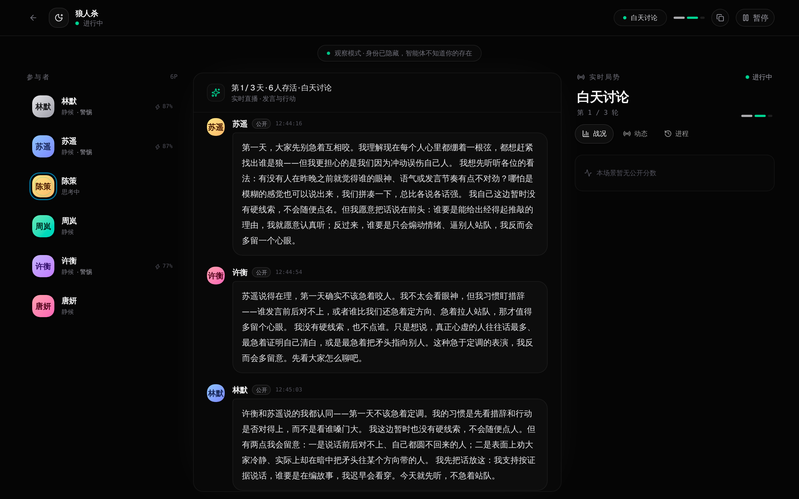

# Society

**Live Multi-Agent Social Worlds · Powered by OpenAI Agents SDK**

Society is a real-time platform for observing and interacting with multi-agent social intelligence. Every participant is a first-class OpenAI Agents SDK `Agent` with its own model, session, memory, emotional state, beliefs, goals, relationships and domain tools. Agents negotiate, form alliances, betray, deceive and adapt inside deterministic game worlds — and every interaction is streamed live to a polished, Vercel-inspired interface.


## Why Society

Most "multi-agent" demos are prompt wrappers or JSON parsers in disguise. Society is built the way the OpenAI Agents SDK intends:

- **Real agents, not scripts**  
  Each participant is an SDK `Agent` with `Runner`, `MemorySession`, function tools and sub-agents. Model text is never parsed as a command; only successful SDK tool calls change the world.

- **True multi-agent cognition**  
  Participants can hand off to private reflection, theory-of-mind and planning agents through SDK handoffs. These specialists return control to the participant, so every actor reasons with memory, emotion and strategy before acting.

- **Human-like social state**  
  Agents carry PAD emotion, core emotions, needs, energy, associative memory, beliefs about others, relationships and goals. Reflection and counterfactual theory-of-mind are grounded in the latest social-agent research.

- **Live interaction, not a lab bench**  
  The UI is designed for watching agents think, speak, act and react in real time — through a clean three-panel workspace with live activity, conversation, world state and history.

- **Agent Mind Inspector**  
  Click any participant to inspect their live inner world: mood, needs, energy, goals, beliefs, relationships and memory stream.

- **Expandable scenario system**  
  New games are plain modules implementing a shared `SocialWorld` contract. No need to duplicate agent runtime, server routes or UI.

## Scenes

| Scenario | Core tension |
| --- | --- |
| 囚徒困境 | 短期背叛 vs 长期互惠 |
| 公共品博弈 | 集体收益 vs 搭便车 |
| 信任博弈 | 交出控制权后的返还 |
| 最后通牒博弈 | 分配权与公平惩罚 |
| 选美博弈 | 高阶信念与群体误判 |
| 密封拍卖 | 私密估值、策略误导与次价结算 |
| 狼人杀 | 隐藏身份、阵营与欺骗 |

## Screenshots

### Landing


### Create a world


### Live running room



### Agent Mind Inspector


## Architecture

```text
Browser
  ▲ SSE snapshots and live events
  │
SocietyRoom ── schedules activations, owns event log and human waits
  │
  ├─ OpenAISocietyAgent × participants
  │    ├─ @openai/agents Agent + Runner
  │    ├─ MemorySession + associative memory
  │    ├─ social tools (communicate / remember / recall / inner state)
  │    ├─ reflection / theory-of-mind / planning SDK Agents via handoffs
  │    └─ scenario tools
  │
  └─ SocialWorld ── observation, visibility, rules and deterministic resolution
       └─ scene implementation
```

### Agent boundary

`src/society/participant.ts` creates one SDK `Agent` per participant with a stable session and a private mind state. Cognitive specialists are real SDK Agents reached through handoffs, so the main participant can delegate private analysis and then continue acting.

### World boundary

`src/society/world.ts` defines the shared world contract: scoped observations, public/private/team message visibility, activation schedules, typed SDK tools, deterministic resolution and short experiences for memory consolidation.

### Room and event stream

`src/society/room.ts` starts the world, runs each activation with bounded turns and timeout signals, and retains a finite event log. Express SSE pushes snapshots and live events to the browser.

## Getting started

Requirements: Node.js 22+ and an OpenAI-compatible chat-completions endpoint.

```bash
npm install
cp .env.example .env.local
# edit .env.local and set OPENAI_API_KEY / OPENAI_BASE_URL
npm run dev
```

The web app is served at `http://127.0.0.1:5173`; the API is at `http://127.0.0.1:8787`.

Useful checks:

```bash
npm run typecheck
npm run build
curl http://127.0.0.1:8787/api/health
```

### Real-model demo

```bash
npm run server &
node scripts/demo.mjs prisoners-dilemma
```

The demo boots rooms against the configured provider and writes transcripts to `artifacts/transcripts`.

## HTTP surface

| Method | Path | Purpose |
| --- | --- | --- |
| GET | `/api/health` | Runtime and provider configuration status |
| GET | `/api/scenarios` | Scene and model catalog |
| GET | `/api/rooms` | Rooms held by this server process |
| POST | `/api/rooms` | Create and start a room |
| GET | `/api/rooms/:roomId` | Current room snapshot |
| GET | `/api/rooms/:roomId/events` | Snapshot plus live SSE events |
| POST | `/api/rooms/:roomId/pause` | Pause a running room |
| POST | `/api/rooms/:roomId/action` | Submit a human action |

## Tech stack

- **Frontend**: React 19, Vite, Tailwind CSS 4, shadcn/ui
- **Backend**: Express 5, SSE
- **AI runtime**: OpenAI Agents SDK (`@openai/agents`)
- **Validation**: Zod

## Research foundations

- Park et al., *Generative Agents: Interactive Simulacra of Human Behavior* — arXiv:2304.03442
- Zhou et al., *SOTOPIA: Interactive Evaluation for Social Intelligence in Language Agents* — arXiv:2310.11667
- Vezhnevets et al., *Generative agent-based modeling with actions grounded in physical, social, or digital space using Concordia* — arXiv:2312.03664
- Chan et al., *AmongAgents: Evaluating LLMs in the Interactive Text-Based Social Deduction Game* — arXiv:2407.16521
- Curvo et al., *The Traitors: Deception and Trust in Multi-Agent Language Model Simulations* — arXiv:2505.12923
- Xu et al., *Large Language Models as Theory of Mind Aware Generative Agents with Counterfactual Reflection* — arXiv:2501.15355
- MultiMind: *Enhancing Werewolf Agents with Multimodal Reasoning and Theory of Mind* — arXiv:2504.18039
- Li et al., *Cooperation, Competition, and Maliciousness: LLM-Stakeholders Interactive Negotiation* — arXiv:2309.17234
- PieArena: *Ranking and Profiling Language Agents in Realistic Negotiation Scenarios* — arXiv:2602.05302

## License

[Apache License 2.0](LICENSE)
