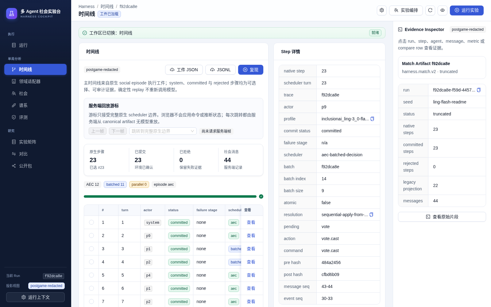
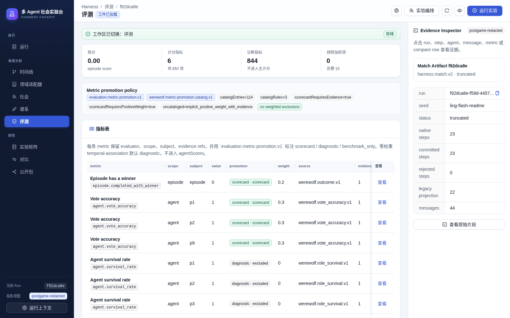

# Werewolf Multi-Agent Social Harness

[](https://github.com/multi-zhangyang/werewolf-multi-agent-social-harness/actions/workflows/validate.yml)


[](LICENSE)

**可重放、可分叉、可评测的多 Agent 对抗社会实验运行时。**

本项目提供一套领域中立的 harness：调度有状态社会 Actor，管理作用域观察与通信拓扑，校验类型化动作，提交确定性环境转换，并把每一步沉淀为可审计工件。狼人杀是首个高压证明域，用于验证隐藏信息、欺骗、联盟、说服与投票；它不是产品边界。


<p align="center">
  <a href="#why">Why</a> ·
  <a href="#architecture">Architecture</a> ·
  <a href="#capabilities">Capabilities</a> ·
  <a href="#cockpit">Cockpit</a> ·
  <a href="#quick-start">Quick start</a> ·
  <a href="#cli--api">CLI &amp; API</a> ·
  <a href="#validation">Validation</a> ·
  <a href="#license">License</a>
</p>

---

## Why

多数 “multi-agent” 演示把多个模型对话拼成 transcript，然后用 UI 假装有社会系统。这套 harness 解决的是另一类问题：

| 问题 | 系统给出的答案 |
| --- | --- |
| 某个 Actor 当时知道什么？ | 作用域 observation、channel、delivery receipt、exposure evidence |
| 为什么做出这个动作？ | 私有状态、memory、belief、关系、目标、policy、reasoner memo、仲裁记录 |
| 模型输出能不能改世界？ | 不能。候选必须经过 policy / 仲裁 / 环境合法性检查 |
| 失败发生在哪？ | 生命周期状态、失败阶段、流式调用遥测、部分工件 |
| 能否复现？ | 不调用模型的 deterministic replay + state/message hash |
| 能否从中途改条件？ | checkpoint、fork provenance、分支树 |
| 指标是否可审计？ | 版本化 evaluator、evidence refs、promotion policy、可重建聚合 |
| 浏览器会不会泄漏隐藏真相？ | 服务端投影权威；live / postgame-redacted / truth-redacted 分轨 |

边界是硬约束：

```text
Agent     = identity + private social state + policy + optional reasoner + arbitration
Reasoner  = optional cognition component inside an agent
Harness   = scheduling, visibility, communication, legality, artifacts, replay, fork, evaluation
Environment = domain truth and deterministic transitions
Cockpit   = operator UI over server projections and artifacts
```

JSON 是命令、工件与 API 的编码，不是 agency 的定义。

---

## Architecture

```text
Experiment Spec
      │
      ▼
Control Plane ── profile / seed / scheduler / timeout / assignment
      │
      ▼
Social Runner ── AEC | batched decision | true parallel (stepBatch)
      │
      ├─ ObservationAssembler ── scoped views + visible social messages
      ├─ SocialCommunicationBus ── channels, receipts, deterministic seq
      ├─ Agent Scaffold ── memory / beliefs / relationships / goals / norms
      ├─ Policy + Arbitrator ── legal candidates, optional streaming reasoner
      └─ Environment Adapter ── typed commands, domain transitions, events
      │
      ▼
Artifact Plane ── match / trajectory / social episode / metrics / failures
      │
      ├─ Replay Engine ── model-free
      ├─ Checkpoint / Fork ── native boundary provenance
      ├─ Evaluator Registry ── evidence-backed metrics
      └─ Tournament / Matrix ── multi-episode aggregation
      │
      ▼
Server API ── redacted projections + operator surfaces
      │
      ▼
React Cockpit ── research UI, not a second source of truth
```

当前仓库已包含：

- TypeScript harness 与 Werewolf 领域适配器
- OpenAI-compatible Chat Completions / Responses、Anthropic Messages 流式协议适配
- Express API 与 Ant Design React cockpit
- deterministic tests、Playwright fixture cockpit、GitHub Actions CI

---

## Capabilities

| Layer | What ships |
| --- | --- |
| Society actors | Memory, beliefs, relationships, reputation, norms, commitments, coalitions, goals, mutation journal |
| Scheduling | AEC, batched decision, true parallel joint `stepBatch` |
| Communication | Public / team / private / system channels with immutable audience snapshots and delivery receipts |
| Observation | Exposure evidence from scoped observations, never inferred from `recipientIds` alone |
| Actions | Reasoner candidates stay advisory; environment remains final authority |
| Artifacts | Native social steps, trajectory projection, JSONL, redaction, integrity validation |
| Replay / Fork | Model-free replay; native-boundary checkpoints; durable fork lineage |
| Evaluation | Versioned evaluators, evidence refs, promotion catalog, tournament packs |
| Cockpit | Runs, timeline, domain adapter, society graph, lineage, evaluation, matrix, compare, public packs |

---

## Cockpit

Cockpit 是研究与运维界面。它只消费服务端 API 与已记录工件，不根据 transcript 推断隐藏角色、关系或胜负。

截图均来自本机对真实 OpenAI-compatible 流式模型调用后的 `postgame-redacted` 工件，不包含 API key、endpoint 或私有环境配置。

### Research overview

运行注册表、原生步骤密度与脱敏工件摘要：


### Domain adapter review

Werewolf 作为首个证明域的赛后公开局面与事件账本：


### Society evidence

服务端权威社会图、消息流与 scoped exposure：


### Timeline

原生 scheduler step、提交状态与执行证据：



### Evaluation

版本化指标、证据引用与 promotion 分类：



投影视图：

| View | Use |
| --- | --- |
| `live-public` | 运行中公开桌面；无隐藏角色 / 私有 memo |
| `postgame-redacted` | 本地研究；私有认知脱敏，可保留赛后真相 |
| `truth-redacted` | 对外分享；私有证据与赛后真相均脱敏 |

---

## Quick start

### Requirements

- Node.js 22+
- npm 10+
- OpenAI-compatible streaming endpoint for live model runs

### Install

```bash
git clone https://github.com/multi-zhangyang/werewolf-multi-agent-social-harness.git
cd werewolf-multi-agent-social-harness
npm install
cp .env.example .env
```

### Configure

`.env` 中配置：

```bash
LLM_CHAT_COMPLETIONS_URL=https://your-provider.example/v1/chat/completions
LLM_API_KEY=your-key
LLM_MODELS=your-model-id
LLM_STREAM=true
```

Live 请求必须使用 `stream: true`。OpenAI-compatible Chat Completions 路径默认不发送 `max_tokens` / `max_completion_tokens`。不要把密钥写入 README、测试、截图或提交到仓库。

### Local cockpit

```bash
npm run dev
```

- API: `http://127.0.0.1:8787`
- Web: Vite dev server proxies `/api` to the API

### Smoke checks

```bash
npm run typecheck
npm test
npm run build
npm run test:e2e
```

---

## CLI & API

### Probe a model through the production actor boundary

```bash
npm run agent:probe -- --models=your-model-id --timeout=90s
```

Probe 走真实流式 completion → production scaffold cognition → policy/arbitration → pure environment `validateAction()`。它不提交环境转换，也不写 durable actor state。

### Bounded match

```bash
npm run arena:match -- \
  --models=your-model-id \
  --maxTransitions=8 \
  --timeout=180s \
  --json=summary
```

省略 `maxTransitions` 表示不设 transition 上限；截断与失败都会保留工件。

### Tournament

```bash
npm run arena:tournament -- \
  --models=your-model-id \
  --games=1 \
  --maxTransitions=8 \
  --timeout=300s \
  --json=summary
```

### Replay

```bash
npm run arena:replay -- --artifact=path/to/match.json
```

Replay 不调用模型。

### Selected HTTP routes

| Method | Path | Purpose |
| --- | --- | --- |
| `GET` | `/api/health` | Safe health summary |
| `GET` | `/api/config` | Models, profiles, capabilities |
| `POST` | `/api/matches/run` | Start match; `live: true` returns 202 + live projection stream |
| `GET` | `/api/matches/:id/live` | Strict public live table |
| `GET` | `/api/matches/:id/artifact?view=postgame-redacted` | Research artifact projection |
| `POST` | `/api/matches/:id/replay` | Model-free replay summary |
| `POST` | `/api/matches/:id/checkpoints` | Final or prefix checkpoint |
| `POST` | `/api/checkpoints/:id/fork` | Fork from checkpoint |
| `GET` | `/api/comparisons` | Comparison registry |
| `POST` | `/api/tournaments/run` | Tournament + optional artifact export |

Operator surfaces such as full artifacts, checkpoint mutation, and postgame-native replay remain local/loopback gated where configured.

---

## Validation

Repository gates:

```bash
npm run ci
```

Equivalent to:

```bash
npm run typecheck
npm test
npm run build
npm run test:e2e
```

CI runs the same path on GitHub Actions (`Validate` workflow).

Live provider validation is separate and must be real streaming:

```bash
npm run agent:probe -- --models=your-model-id --timeout=90s
npm run arena:match -- --models=your-model-id --maxTransitions=4 --timeout=180s --json=summary
```

A truncated bounded match with zero harness errors is valid streaming-path evidence; only `game_over` is a completed domain outcome.

---

## Project layout

```text
src/
  core/                 Werewolf rules and deterministic transitions
  harness/              Generic social runner, scaffold, artifacts, evaluation, tournament
  agents/               Provider-neutral streaming model clients
  server/               Express API, projections, redaction, artifact stores
  components/cockpit/   Ant Design research cockpit surfaces
  App.tsx               Cockpit shell
  scripts/              CLI entrypoints
tests/                  Deterministic unit and integration tests
e2e/                    Playwright cockpit fixtures and accessibility checks
docs/                   Architecture notes and cockpit screenshots
```

---

## Design principles

1. **Harness first.** Domain adapters prove the runtime; they do not define it.
2. **Environment authority.** Hidden truth and legal transitions never live in prompts or React state.
3. **Scoped society.** Visibility, delivery, and exposure are first-class records.
4. **Optional models.** Deterministic policy actors remain valid agents.
5. **Streaming live calls.** Real provider decisions use streaming; non-streaming is for tests/fakes only.
6. **Evidence over self-report.** Metrics cite artifacts, messages, events, and state.
7. **Safe presentation.** Public and research projections are server-owned and fail closed.

---

## Roadmap

Stable today:

- Generic social runner and Werewolf adapter
- Streaming multi-protocol model clients
- Artifact / replay / checkpoint / fork
- Evaluator registry and tournament packs
- Research cockpit over redacted projections

Next focus areas:

- Additional domain adapters beyond Werewolf
- Richer causal / counterfactual social metrics with explicit contracts
- Stronger public-share packaging and operator analytics
- Further cockpit density and accessibility polish

---

## Contributing

1. Keep harness / domain / agent / API / UI ownership boundaries intact.
2. Prefer extending existing contracts over inventing parallel ones.
3. Add focused tests for any public behavior change.
4. Never commit `.env`, API keys, private artifacts, or raw provider payloads.
5. Run `npm run typecheck`, `npm test`, and relevant e2e before opening a PR.

---

## License

Apache License 2.0. See [LICENSE](LICENSE).
