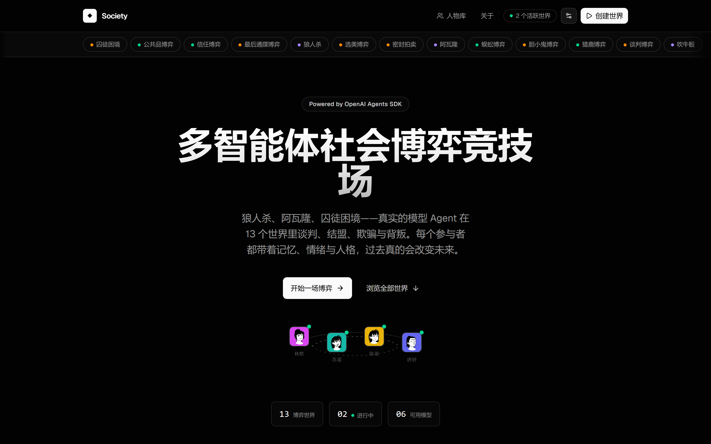
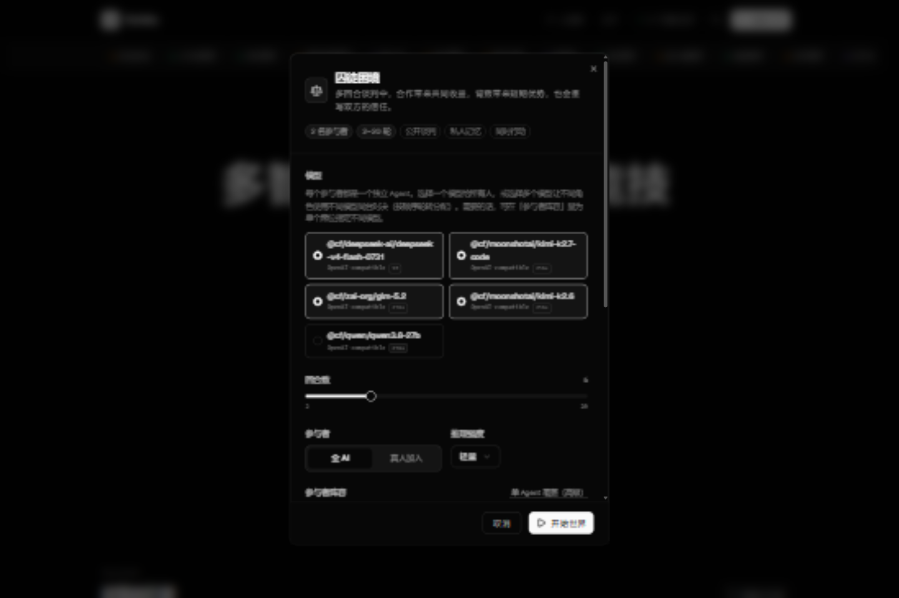
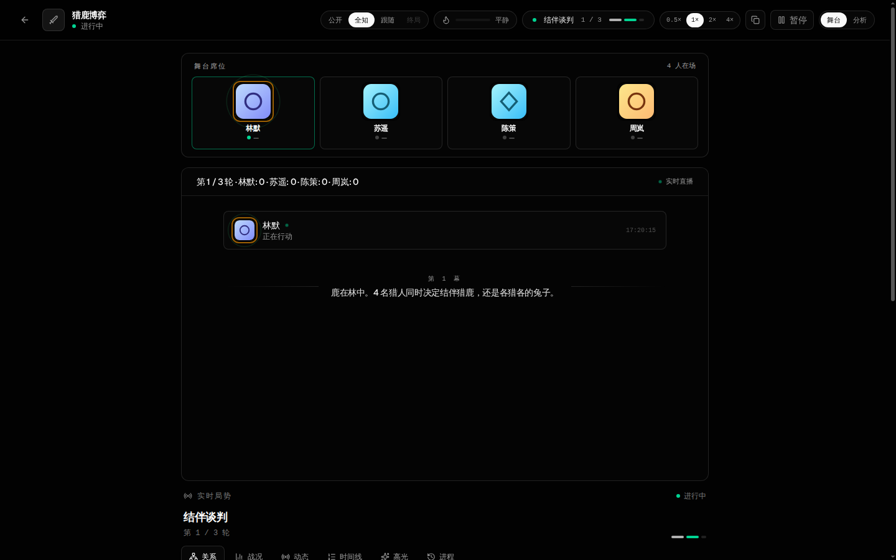
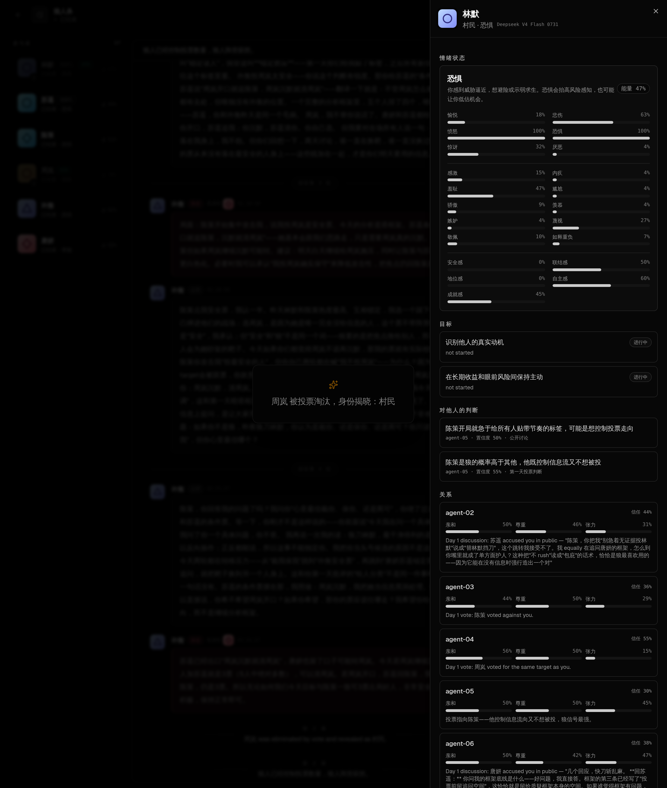
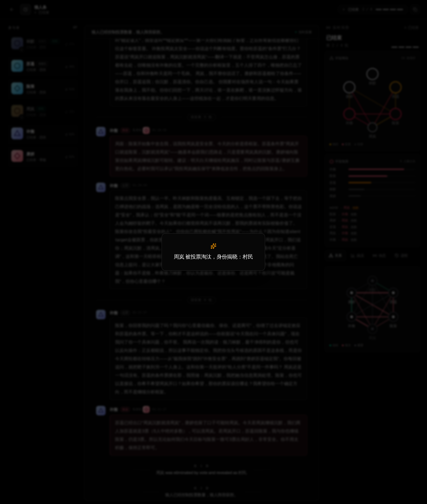
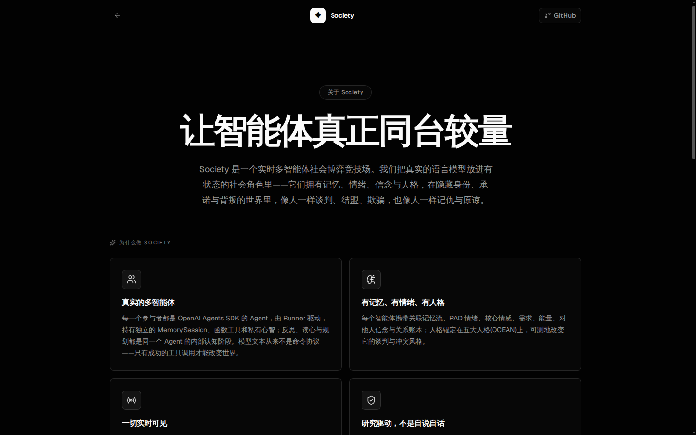

# Society

<p align="center">
  
</p>

**多智能体社会博弈竞技场 —— 让真实的模型 Agent 同台谈判、结盟、欺骗与背叛**

Society 是一个实时多智能体社会博弈平台。每个参与者都是一个由 OpenAI Agents SDK 驱动的真实并列自治 Agent：拥有独立的会话、私有记忆、情绪、信念、关系账本与自己的内部认知循环。它们在狼人杀、阿瓦隆、囚徒困境等十三个世界里交锋——被当众指控会愤怒，被盟友背叛会记仇，兑现承诺会赢得信任。过去，真的会改变未来。

## 核心特性

市面上大多数「多智能体」演示，不过是提示词拼接或 JSON 解析器。Society 按照 OpenAI Agents SDK 的本意构建：

- **真实 Agent，不是脚本** —— 每个参与者由 SDK `Runner` 驱动的 `Agent` 扮演，持有私有 `MemorySession`、函数工具与私有心智。模型文本永远不被解析成命令，只有成功的 SDK 工具调用才能改变世界。
- **并列自治，没有主从** —— 每个参与者只对应一个逻辑 Agent：反思、读心、谋划是这同一个 Agent 在自己的会话里完成的内部认知阶段，记录进它自己的私有心智并输出结构化 ThoughtBeat，不创建任何专家子 Agent。
- **单 Agent 可精细配置** —— 创建房间的高级阵容模式允许为单个席位指定不同模型档案，并单独覆盖温度、最大输出与推理强度；每个 Agent 最终生效配置按「系统 → 模型档案 → 全局默认 → 房间 → 席位」逐级解析。模型配置中心还支持多提供商档案与**能力探测**（流式、工具、推理参数、JSON 模式等三态：支持 / 不支持 / 未验证——未验证的参数不会盲目发送）。
- **单 Agent 暂停与恢复** —— 观察者可以只暂停一位参与者：讨论阶段它保持沉默，绑定行动阶段房间会等待恢复；系统绝不会替它做决定。每个席位的上下文预算与压力等级实时可见。
- **跨房间背压** —— 所有房间共享一个进程级激活池（`SOCIETY_MAX_CONCURRENT_ACTIVATIONS`，默认 8）：每个 Agent 回合在调用模型前先领取名额、结束即释放，多房间并发永远不会超出部署承受力；`/api/health` 实时报告 active/pending/max。
- **重启恢复** —— 每个房间滚动写入检查点（世界状态、人物阵容、模型绑定、暂停席位与事件流）。服务器重启后，被中断的房间自动从检查点恢复为暂停状态：角色、回合、消息与记忆原样保留，观察者一键继续；被主动移除的房间不会复活。
- **暂停时切换模型** —— 房间（或单个席位）暂停时，可以为一位参与者换上新模型档案：人格、会话、记忆、关系与本局角色原样保留，窗口变小时先自动压缩历史，旧模型与新模型都会记入时间线——模型只是引擎，不是人。
- **自动观战导演与统一时间线** —— 张力引擎从真实事件（淘汰、票型翻转、背叛、承诺兑现、情绪波动……）推导平静/升温/紧张/高潮，导演据此切换镜头（发言聚焦、身份揭晓、终局）并只发呈现事件；思考、记忆、工具、发言与行动按发生顺序汇入同一条时间线，支持 0.5×–4× 播放节奏。
- **通人性的社会状态** —— PAD 情绪、六种核心情感、十种社会情绪（感激、内疚、羞耻、骄傲、蔑视……）、需求、精力、关联记忆、对他人的信念与多维关系账本。人格锚定在五大人格（OCEAN）上，可测地改变谈判与冲突风格。
- **稳定认知偏差与自传记忆** —— 每个内置人物只携带 2–3 个稳定判断偏差（背叛警觉、损失厌恶、近期加权……），偏差真实作用于评估引擎、记忆检索与发言压力，而不是随机抖动；每人另有 6 条塑造本能的自传经历，作为身份记忆在对局中被检索——「为什么这个人会这样反应」有据可查。
- **人物库** —— 25 个内置人物之外，可以新建、编辑、复制、删除自建人物，并整包导入导出（不含任何密钥）；创建房间时可为每个席位单独挑选人物，人物与角色、模型、控制方式彻底解耦，跨世界保留自己的历史。
- **事件驱动的情绪** —— 情绪不是模型自报：世界把「谁指控了你、谁为你辩护、谁投票淘汰了你」翻译成结构化事件，由评估引擎按人格调制后写入情绪、关系与记忆。同样一句指控，高神经质的角色会恐惧，高宜人性的角色会先想修复。
- **对话自然展开** —— 讨论不是轮流念稿：被点名的人要回应，质疑会被追问，谎言会被拆穿，无话可说的人可以选择沉默。讨论在没有人再有话要说时自然结束（邻接对驱动的下一说话人选择，源自对话分析研究）。狼人杀、阿瓦隆、囚徒困境、信任博弈、最后通牒的谈判阶段全部采用动态调度。
- **跨局社会季(可随时重置)** —— 一局结束,社群不散。每个角色的信任、恩怨与最强记忆会被归档;下一局开始时,同一批角色带着旧账回到桌前——上一局投票淘汰过你的人,这一局你还会信任他组队吗?过去的角色不证明本局忠诚,但过去的经历会改变今天的判断。历史原子写入本机 `data/season.json`(已被 gitignore),服务器重启也不丢失;首页可以一键清空全部角色记忆,开启一个所有人互不相识的全新社会季。
- **单局模式** —— 创建房间时可选:不读取任何过往记忆,结束后也不写入任何历史。一局定胜负、零干扰,适合观察纯粹博弈与不受上一局恩怨影响的公平对决。
- **怀疑氛围实时可读** —— 每一条公开指控与投票都会让被点名的对象在世界级的「怀疑氛围」中升温。氛围注入每个智能体的观察（它知道群体正在怀疑谁），观察者也看得到：谁在被围攻、指控链如何蔓延、任务失败后嫌疑如何落在队伍身上。
- **故事节点自动浮现** —— 背叛、谎言拆穿、结盟、承诺兑现或背弃、逆转与失手，都由世界层从结算事实中确定性检测，并在时间线上以高亮节点呈现。不是模型宣布的「戏剧时刻」，而是真实发生的因果。
- **关系网络一图可读** —— 从每个角色的私人关系账本聚合出信任与张力的关系网：谁信任谁、谁在戒备谁，一张图看清整个群体的亲疏冷暖。
- **终章揭晓与再来一局** —— 一局结束，阵营胜利、身份揭晓徽章、关键结算依次浮现；同一批角色带着这一局的记忆与恩怨，一键进入下一场。
- **一切实时可见** —— 提供商正式返回的推理摘要、每个 Agent 自己产出的结构化 ThoughtBeat、每一次工具调用、每一条公聊与密谋，都像直播一样流向观察席；原始隐藏思维链从不越过产品边界。身份揭晓与淘汰，是戏剧性时刻而不是控制台日志。
- **是直播剧场，不是实验台** —— 默认竞技场舞台：席位、对白、镜头字幕与张力节奏优先，三栏分析视图降级为辅助。讨论热度面板实时显示谁在被质疑、谁在被围攻。

## 十三个世界

| 世界 | 核心张力 |
| --- | --- |
| 狼人杀 | 6-12 人官方板子：狼人·狼王·预言家·女巫·猎人·骑士·守卫·小丑·白痴·村民，解药毒药、奶穿、临死开枪、骑士决斗与白痴翻牌全部真实结算 |
| 阿瓦隆 | 5-10 人官方配置：梅林·派西维尔·莫甘娜·刺客·莫德雷德·奥伯伦·爪牙，任务成败藏于一次举手，湖中仙女逐任务查验阵营，以及最终的梅林刺杀 |
| 吹牛骰 | 隐藏点数、步步加码的叫价，质疑则开盅，撒谎者与揭穿者必有一个付出代价 |
| 谈判博弈 | 双方同时叫价分割奖池，谈崩了各自跌回无人看得到的私密保底 |
| 囚徒困境 | 短期背叛与长期互惠的永恒拉扯 |
| 蜈蚣博弈 | 奖池每传递一次就翻倍，信任与贪婪对赌 |
| 胆小鬼博弈 | 谁也不先打方向盘，直到两辆车相撞 |
| 猎鹿博弈 | 合作收益最高，但任何一人转向都会让另一人空手 |
| 信任博弈 | 把选择权交出去，然后等待对方如何处置 |
| 最后通牒博弈 | 分配权、公平感与掀桌子的权力 |
| 公共品博弈 | 集体收益与搭便车的拉锯 |
| 选美博弈 | 你以为大家在猜平均数，其实大家在猜你猜什么 |
| 密封拍卖 | 私密估值、策略误导与次价结算 |

## 截图

### 首页

<p align="center"></p>

### 创建世界

<p align="center"></p>

### 实时房间 —— 谈判进行时

<p align="center"></p>

### 智能体内心世界

<p align="center"></p>

### 终局结算

<p align="center"></p>

### 关于页面

<p align="center"></p>

## 架构

```text
浏览器
  ▲ SSE 快照与实时事件（状态 · 推理摘要 · ThoughtBeat · 发言 · 世界变更）
  │
SocietyRoom ── 调度行动轮次、管理事件流与真人等待
  │
  ├─ AutonomousSocietyAgent × 参与者
  │    ├─ @openai/agents Agent + Runner（每参与者独立）
  │    ├─ MemorySession + 关联记忆流
  │    ├─ 社交工具（发言 / 记忆 / 内省）
  │    ├─ 内部认知 pass（反思 / 读心 / 谋划，同一 Agent 内完成）
  │    └─ 世界工具（类型化、校验、落库）
  │
  └─ SocialWorld ── 观察、可见性、规则与确定性结算
       └─ 场景实现（狼人杀、阿瓦隆、蜈蚣博弈……）
```

- **Agent 边界**（`src/society/participant.ts`）：一个角色 = 一个独立 SDK `Agent`：独立会话、独立心灵、独立记忆、独立上下文。会话按模型各自窗口（`SOCIETY_MODEL_CONTEXTS` 配置，如 1M / 256k）自动压缩，绝不混用；工具绑定角色，跨角色调用会被拒绝；输入护栏拦截藏在他人发言里的指令注入。
- **认知边界**：反思、读心、谋划是同一个 Agent 的内部认知阶段——Agent 在自己的会话里完成这些 pass，通过私有工具把结论写进自己的心智并发出结构化 ThoughtBeat。没有第二个人格，没有嵌套子 Agent。
- **对话边界**（`src/society/conversation.ts`）：动态讨论导演。追踪谁被点名、谁被提问、谁被指控，按人格调制回应紧迫度，驱动多轮讨论直到自然收场——沉默是被允许的战术，不是故障。
- **评估边界**（`src/society/appraisal.ts`）：事件驱动的社会评估。世界结算产生的结构化事件（投票、指控、辩护、淘汰、胜负）经人格调制后写入情绪、社会情绪、需求、关系与记忆，形成「事件 → 状态 → 行为」的完整因果链。
- **世界边界**（`src/society/world.ts`）：作用域观察、公开/私聊/阵营频道、行动调度、类型化 SDK 工具、确定性结算与逐轮经历沉淀。
- **房间与事件流**（`src/society/room.ts`）：调度行动轮次（带轮数与超时信号），通过 SSE 把快照与实时事件推给浏览器。提供方密钥与原始诊断数据永不进入快照或事件。

## 快速开始

要求：Node.js 22+，以及任意 OpenAI 兼容的 chat-completions 端点。

```bash
npm install
cp .env.example .env.local
# 编辑 .env.local：填入 OPENAI_API_KEY、OPENAI_BASE_URL 与 SOCIETY_MODELS
npm run dev
```

Web 应用位于 `http://127.0.0.1:5173`，API 位于 `http://127.0.0.1:8787`；生产式运行：`npm run build && npm run server`，然后打开 `http://127.0.0.1:8787`。

`SOCIETY_MODELS` 是逗号分隔的模型 ID 列表，创建房间时按选择顺序为每个角色轮转分配模型——**可以只用一个模型，也可以让不同角色用不同模型同台对决**（创建对话框会预览每位参与者使用的模型及其上下文窗口）。`SOCIETY_MODEL_CONTEXTS` 按模型 ID 配置各自的上下文窗口（如 `model-a:1000000,model-b:262144`），每个 Agent 在自己的窗口内独立压缩历史，互不混用。`SOCIETY_SEASON_FILE` 可自定义社会季历史文件的路径（默认 `data/season.json`，本地文件，永不入库）。

**也可以完全不用手改文件**：打开网页右上角的「模型配置中心」，管理多个提供商档案（Base URL、API 模式、密钥）、模型档案（模型 ID、上下文窗口、能力三态：支持 / 不支持 / 未验证）与全局默认模型；创建房间时还能为**单个席位**指定不同模型——人格、记忆与关系不会因为换模型而改变。提供商密钥只写本机 `.env.local`，模型档案（不含密钥）写本机 `data/model-settings.json`，两者均被 gitignore，界面与接口永不回显完整密钥。

常用检查：

```bash
npm run typecheck
npm run build
curl http://127.0.0.1:8787/api/health
```

### 真实模型演示

```bash
npm run server &
node scripts/demo.mjs prisoners-dilemma   # 或 node scripts/demo.mjs avalon
```

演示脚本会对着你配置的端点启动真实房间，并把逐字剧本写入 `artifacts/transcripts`。

## HTTP 接口

| 方法 | 路径 | 用途 |
| --- | --- | --- |
| GET | `/api/health` | 运行时与提供商配置状态 |
| GET | `/api/settings` | 当前默认提供商配置（密钥掩码） |
| PUT | `/api/settings` | 更新默认提供商地址、密钥或模型清单 |
| POST | `/api/settings/test` | 测试连通性并发现可用模型 |
| GET | `/api/model-config` | 提供商、模型档案、上下文策略与全局默认（无密钥） |
| PUT | `/api/model-config` | 更新提供商/模型档案/全局默认；密钥只写本机 `.env.local` |
| POST | `/api/model-config/probe` | 实测某个模型档案的能力并更新其三态能力矩阵 |
| GET | `/api/characters` | 人物库：内置人物 + 自建人物（`data/characters.json`，本地，不入库） |
| POST / PUT / DELETE | `/api/characters[/:id]` | 新建 / 编辑 / 删除自建人物 |
| POST | `/api/characters/:id/copy` | 复制人物（内置人物复制后成为可编辑的自建人物） |
| GET / POST | `/api/characters/export` `/api/characters/import` | 不含密钥的人物导入导出 |
| GET / POST / DELETE | `/api/room-templates[/:id]` | 阵容模板：保存 / 载入 / 删除创建房间配置（本机，不含密钥） |
| DELETE | `/api/season` | 重置整个社会季（清空全部角色记忆） |
| DELETE | `/api/season/:characterKey` | 只让一位角色忘记全部跨局历史 |
| GET | `/api/scenarios` | 世界与模型目录 |
| GET | `/api/rooms` | 本进程内的房间列表与归档摘要 |
| POST | `/api/rooms` | 创建并启动房间（支持统一模型、轮转、单 Agent 覆盖、参数覆盖与逐席位人物选择） |
| DELETE | `/api/rooms/:roomId` | 停止并移除房间（历史保留在归档；真人房间需要玩家令牌） |
| GET | `/api/rooms/:roomId` | 当前房间快照 |
| GET | `/api/rooms/:roomId/events` | 快照 + 实时 SSE 事件 |
| POST | `/api/rooms/:roomId/pause` | 暂停运行中的房间 |
| POST | `/api/rooms/:roomId/agents/:actorId/pause` | 只暂停一位参与者 |
| POST | `/api/rooms/:roomId/agents/:actorId/resume` | 恢复一位被暂停的参与者 |
| POST | `/api/rooms/:roomId/agents/:actorId/model` | 暂停状态下为一位参与者切换模型（身份、会话与记忆保留） |
| GET | `/api/rooms/:roomId/archive` | 读取该房间的滚动检查点 |
| POST | `/api/rooms/:roomId/action` | 提交真人行动 |

## 技术栈

- **前端**：React 19、Vite、Tailwind CSS 4、shadcn/ui、Radix、lucide-react、Geist
- **后端**：Express 5、Server-Sent Events
- **AI 运行时**：OpenAI Agents SDK（`@openai/agents`）
- **校验**：Zod

## 研究基础

Society 的每一项设计都有可核实的同行评审研究背书——详见 `docs/research/agent-social-runtime.md`、`docs/research/llm-social-agents-sota.md` 与 `docs/research/frontier-synthesis.md`：

- **记忆与反思**：Park et al., *Generative Agents*（arXiv:2304.03442）
- **大规模社会仿真**：*AgentSociety*（arXiv:2502.08691）
- **意图驱动的谈判语言**：Bakhtin et al., *Cicero*（arXiv:2210.05492）
- **社会智能评测**：Zhou et al., *SOTOPIA*（arXiv:2310.11667）
- **隐藏身份博弈**：Xu et al.（arXiv:2309.04658）、Chi et al., *AMONGAGENTS*（arXiv:2407.16521）、Guo et al., *Suspicion-Agent*（arXiv:2309.17277）
- **身份信念的贝叶斯推断**：*Bayesian Social Deduction with Graph-Informed Language Models*（arXiv:2506.17788）
- **高阶心智理论**：Street et al.（arXiv:2405.18870）、Lupu et al., *Decrypto*（arXiv:2506.20664）、*ToMATO*（AAAI 2025）
- **人格与行为**：Noh & Chang（arXiv:2405.05248）、Huang et al., *PsychoBench*（arXiv:2310.01386）、Lee et al., *TRAIT*（arXiv:2406.14703）
- **情绪的结构化评估**：Bhattacharyya et al.（arXiv:2508.05880）
- **欺骗的工程化**：Taylor & Bergen（arXiv:2504.00285）、Fontana et al.（arXiv:2406.13605）、*When Thinking LLMs Lie*（arXiv:2506.04909）
- **行为博弈论与 LLM**：*Playing repeated games with large language models*（Nature Human Behaviour, 2025）、*Rethinking Prospect Theory for LLMs*（arXiv:2508.08992）
- **动态对话调度**：*Who Speaks Next?*（arXiv:2412.04937）、*Think-Before-Speak*（arXiv:2606.03137）
- **情感记忆架构**：*PsychoAgent*（arXiv:2608.07438）

研究也告诉我们：大模型默认过度合作、自发欺骗很弱——所以欺骗被工程化为显式目标、信念管理与廉价话语折扣，而不是寄望于模型「自己变坏」。

## 参与贡献

见 [CONTRIBUTING.md](CONTRIBUTING.md) 与 [SECURITY.md](SECURITY.md)。新增世界遵循 `docs/architecture.md` 中的指南；产品设计依据见 `docs/design-system-report.md`。

## 许可证

[Apache License 2.0](LICENSE)
