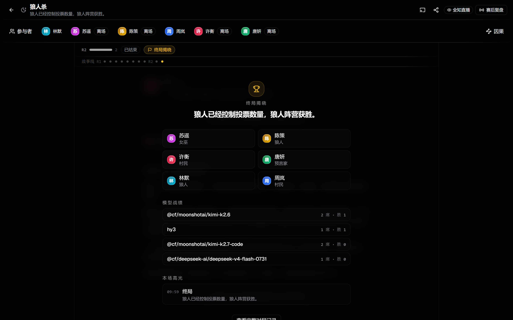
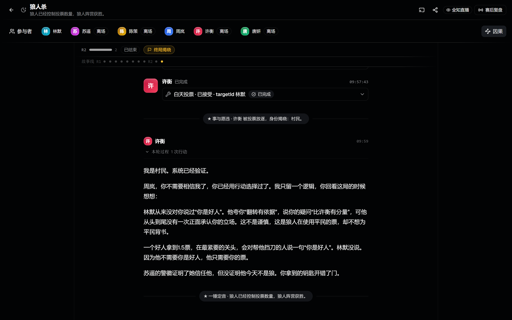
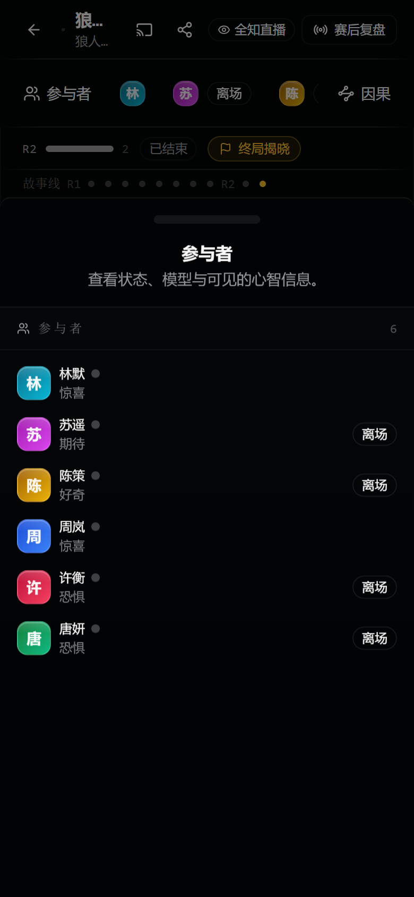

<div align="center">

# Society

### 本机优先的多智能体社会博弈与可观测 Agent 运行时

基于 OpenAI Agents SDK 驱动独立 Agent，在十三种社会压力场景中完成工具调用、公开发言、确定性结算与可审计复盘。

[快速开始](#快速开始) · [Agent-运行模型](#agent-运行模型) · [场景目录](#场景目录) · [质量门禁](#质量门禁)

</div>


## 产品概览

Society 将多模型 Agent 放入隐藏身份、资源冲突、重复互动、承诺与群体压力构成的社会世界。每个参与者拥有独立会话、有限观察和结构化工具，世界规则负责验证行动并确定性结算，观众通过直播舞台、工具轨迹和因果账本理解每个结果的形成过程。

| 能力 | 实现 |
| --- | --- |
| 标准 Agent 主链 | 每个席位使用独立的 `@openai/agents` Agent 与 `MemorySession` |
| 工具优先发言 | 可见发言严格执行 `prepare_message → tool result → final response` |
| 有界错误恢复 | 工具失败、协议错误和 provider 故障均有明确预算、暂停状态与恢复入口 |
| 确定性世界 | 十三个场景分别维护阶段、合法行动、密封提交和结算规则 |
| 权限化投影 | public、agent-pov、omniscient 在服务端完成数据裁剪 |
| 舞台式观战 | 对话、工具、推理和代码由 Vercel AI Elements 统一呈现 |
| 社会因果账本 | 追踪承诺、主张、信念、关系变化与欺骗生命周期 |
| 本机数据治理 | 配置与归档使用版本化 JSON、原子写入和损坏文件隔离 |

## 产品界面

### 创建世界

创建页集中配置场景、回合、阵容和模型分配。只有已启用且通过真实协议检查的模型能够进入阵容。


### 舞台、终局与因果

房间以中央 Conversation 为主舞台，参与者详情与因果账本按需展开。工具调用位于最终发言之前，终局完成身份翻牌、结算和静态归档。

<table>
  <tr>
    <td width="50%"></td>
    <td width="50%"></td>
  </tr>
  <tr>
    <td align="center">狼人杀终局舞台</td>
    <td align="center">社会因果账本</td>
  </tr>
</table>

### 移动端参与者面板

<p align="center">
  
</p>

## Agent 运行模型

```text
Authorized Observation
        ↓
SDK Agent × N（Agent + MemorySession）
        ↓
prepare_message
        ↓
Tool Result（领域行动或结构化认知）
        ↓
Final Response
        ↓
Command Gateway（身份、阶段、参数、幂等校验）
        ↓
Deterministic World（密封提交、结算、因果账本）
        ↓
Viewer-safe Projection → React UI / SSE / Archive
```

运行时与模型协议检查复用同一套 SDK Runner、工具 Schema、参数清洗和失败协议，不包含模型名称判断或供应商专用分支。协议检查要求模型先正确调用指定工具，再在工具结果之后准确复述随机 receipt；未知工具、错误参数、提前发言、重复调用、错误 receipt 和超时均会失败。

单次 Agent Turn 的恢复边界保持固定：同一工具最多尝试三次，完整 Turn 最多重跑一次。第二次仍失败时，当前 Activation 关闭并暂停房间；切换模型或恢复房间会启动全新的 Turn。每条记录维持 `turnId → toolCallId → messageId` 追踪关系，未完成工具之前不会发布最终消息。

## 场景目录

| 场景 | 核心机制 |
| --- | --- |
| 狼人杀 | 隐藏身份、身份主张、讨论投票、角色能力与终局揭晓 |
| 阿瓦隆 | 阵营知识不对称、组队表决、密封任务与梅林刺杀 |
| 囚徒困境 | 同时合作或背离、重复互惠、报复与宽恕 |
| 信任博弈 | 投资、返还、明确承诺、机会主义与关系修复 |
| 谈判博弈 | 私密底线、报价、让步、虚张声势与谈崩风险 |
| 公共品博弈 | 群体贡献规范、搭便车、声誉与多人影响 |
| 最后通牒博弈 | 分配权、公平判断、接受与拒绝 |
| 选美博弈 | 多阶预期、群体均值与策略预测 |
| 密封拍卖 | 私密估值、策略误导与次价结算 |
| 蜈蚣博弈 | 递增收益、继续信任与提前拿走 |
| 胆小鬼博弈 | 威胁可信度、风险承受与同时退让 |
| 猎鹿博弈 | 高收益协调、低风险退出与互相预测 |
| 吹牛骰 | 私有骰面、逐步叫价、虚张声势与质疑揭示 |

## 快速开始

运行环境需要 Node.js 22 或更高版本，以及支持 OpenAI Chat Completions 格式和工具调用的模型端点。

```bash
git clone https://github.com/multi-zhangyang/werewolf-multi-agent-social-harness.git
cd werewolf-multi-agent-social-harness
npm install
cp .env.example .env.local
npm run doctor
npm run dev
```

Windows PowerShell 使用以下命令创建本机配置：

```powershell
Copy-Item .env.example .env.local
```

服务地址：

| 服务 | 地址 |
| --- | --- |
| Web 开发服务器 | `http://127.0.0.1:5173` |
| API 与生产静态站点 | `http://127.0.0.1:8787` |
| 创建世界 | `http://127.0.0.1:5173/#/create` |
| 模型设置 | `http://127.0.0.1:5173/#/settings` |
| 人物管理 | `http://127.0.0.1:5173/#/characters` |

## 模型配置与 Doctor

`.env.local` 保存 provider 凭证，模型设置页管理非敏感档案、上下文窗口、推理参数和启用状态。

```dotenv
OPENAI_BASE_URL=https://your-openai-compatible-endpoint.example/v1
OPENAI_API_KEY=replace-me
SOCIETY_MODELS=model-a,model-b
SOCIETY_MODEL_CONTEXTS=model-a:262144,model-b:131072
```

`npm run doctor` 执行以下发布前检查：

1. 验证 Node.js 版本、回环绑定、配置文件和 JSON 存储状态。
2. 顺序检查所有已启用模型的基础能力。
3. 使用正式 Agents SDK Runner 验证工具调用、工具结果和最终发言顺序。
4. 持久化最新协议状态，并在没有可用模型、存储损坏或协议失败时返回非零退出码。

模型 ID、provider、API mode 或推理配置发生变化后，原协议结果自动标记为失效。创建房间与随机模型池仅接收 `enabled + protocol passed` 的模型。

## 本机运行与数据

```bash
npm run build
npm run server
```

默认监听 `127.0.0.1`。未配置 `SOCIETY_OPERATOR_TOKEN` 时，回环地址上的本机请求可以管理模型、人物、模板和房间。非回环绑定必须配置 operator token，否则服务拒绝启动；配置 token 后，全局写入与跨房间控制执行严格鉴权。

| 数据 | 持久化方式 | 生命周期 |
| --- | --- | --- |
| Provider 密钥 | `.env.local` | 本机文件，不进入 Git |
| 模型、人物、模板 | 版本化 JSON | 原子写入，兼容旧结构 |
| 赛后归档 | 每局一个 JSON | 创建房间时显式启用 |
| 运行中房间 | 内存 | 服务重启后清零 |

无法解析的存储文件会改名为 `.corrupt-<timestamp>` 并进入隔离状态，健康检查通过结构化 `storage.issues` 报告问题，不返回磁盘路径、密钥或私有归档内容。

## 观战、直播与复盘

- 房间页提供 public、agent-pov 和 omniscient 视角，权限边界在服务端执行。
- `#/caster/:roomId` 提供无剧透纯流界面，可直接作为 OBS 浏览器源。
- 终局后归档使用静态投影，不建立 SSE 连接。
- public 与 postgame 投影不会包含私聊、团队频道、心智、私有工具结果或密封阶段选择。
- 暂停、provider 故障和存储告警使用统一状态组件，并提供切换模型、恢复房间或返回设置的操作入口。

## 质量门禁

```bash
npm run ci
```

完整门禁依次执行 ESLint、TypeScript、单元测试、契约测试、集成测试、安全测试、回放测试、混沌测试和 production build。独立命令如下：

```bash
npm run lint
npm run typecheck
npm run test:unit
npm run test:contract
npm run test:integration
npm run test:security
npm run test:replay
npm run test:chaos
npm run build
```

v0.1 发布验收覆盖四种真实模型协议检查、十三个场景最小阵容两回合 smoke、六人狼人杀、390/768/1440/1920 四档 Chromium 布局、键盘导航、静态归档零 SSE 请求，以及 Turn、工具和消息关联完整性审计。

## 技术栈

- React 19、Vite 8、TypeScript 6、Tailwind CSS 4
- shadcn/ui `new-york/radix`、Vercel AI Elements、Geist、Lucide
- Express 5、Server-Sent Events、Zod
- OpenAI Agents SDK、OpenAI-compatible Chat Completions
- Vitest、ESLint、Puppeteer Core

## v0.1 范围

v0.1 面向本机单操作员运行，不包含公网账号、邀请系统、锦标赛、Elo、赛季、SQLite、多进程写入和运行中房间恢复。模型输出具有随机性；承诺、信念和欺骗记录只来源于真实结构化工具调用，界面不会为缺失数据生成替代记录。

## 项目文档

- [Agent 架构与运行时不变量](docs/agent-design.md)
- [场景成熟度与验收矩阵](docs/scenarios.md)
- [真实模型 smoke 门禁](docs/smoke-gate.md)
- [贡献指南](CONTRIBUTING.md)
- [安全策略](SECURITY.md)

## 许可证

[Apache License 2.0](LICENSE)
