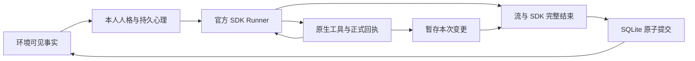

# 通用心理与学习内核

当前执行路径为 `src/agents/sdk.ts`，通用心理模型为 `src/agents/cognition.ts`，多场景适配器位于 `src/runtime/`。合伙人使用同一官方 SDK 执行器及独立的交易心理适配器。旧的 v17 候选准备协议、JSON 工具信封、手写模型循环和 SQLite SDK 会话实现已经退出运行路径；旧结构只用于读取历史数据或明确标注的测试夹具。

## SDK 与模型边界

`Agent`、`Runner`、`OpenAIProvider({ useResponses: true })`、`MemorySession` 和 `tool()` 来自安装的 OpenAI Agents SDK。生产代码直接使用官方 OpenAI 客户端。注入 `Model` 仅用于测试。

| 配置 | 当前值 |
| --- | --- |
| 模型 | gpt-6-luna |
| 上下文 | 256000，人工配置 |
| API | Responses，原生 tools / function_call_output |
| 单次响应工具数量 | 1，parallel_tool_calls=false |
| 单次机会默认模型轮数 | 8 |
| 输出 token 上限 | 不设置；运行、探测和历史案例复测均使用提供商默认行为 |
| HTTP / SDK / 整次激活重试 | 0 / 0 / 0 |
| 服务端存储 / 自动截断 | store=false / truncation=disabled |
| 外部 tracing | 关闭 |

原生工具握手已验证调用与结果回传；尚未测得模型的最大上下文容量。上下文配置为 256000，容量校验由提供商执行，自动截断关闭；不再使用字节数近似 token 数来提前拒绝请求。新运行和阶段配置不包含输出上限，旧 profile 值不参与执行。复测保留原案例，但发送前移除归档中的 maxTokens 或 max_output_tokens；思考强度、行动步数和超时保持独立。

SDK 的输入过滤器只记录输入与步骤，不重写工具输出、不剥离 SDK 消息、不补全参数。官方客户端的 fetch 扩展记录实际 HTTP 请求体并落实完整响应超时，响应字节仍由 SDK 解析。原始请求保存为 `providerRequest`，原生 `call_id` 保持不变。

## 一次行动机会

人物首先评价新的可见事件，然后读取工具返回的正式心理状态，再作计划、记忆、预测和行动选择。世界动作附带单独的私有意图，只有公开 text 进入对话。心理或计划更新与基于该更新的动作不能在同一次模型响应中提交。

官方 `Agent.instructions(runContext)` 在每一步读取本次本地状态，补充当前仍需完成的评价或检验、精确策略编号、剩余步数和完成工具。修订后重新检验、停用后解除要求均反映到下一步说明；初始观察和所有正式回执继续保留。动态进度不替人物选择策略、判断或行动。详见[执行进度](research/activation-progress.md)。

证据显示为 `e1` 等短编号；它们精确映射到原始事件 ID。评价工具只允许尚未评价的新证据，其他记忆与计划工具可引用当前可见来源。人物、频道和证据选项直接进入工具枚举。错误回执提供当前允许的选项，不猜测或转换模型参数。

所有工具先修改本次上下文副本。完整流与 SDK 的 `completed` 都成功、无取消且动作完整后，环境一次提交心理、事件、通信和行动。无完整终止事件、重复终止、多工具响应、不完整输出、流尾错误、超时、取消及重复激活都会阻止提交。

单次请求的超时覆盖响应头与完整响应体，通过官方客户端支持的 fetch 信号中断读取；EOF、读取错误和取消均清理该请求的计时器。这个时限与整次激活的总时限分开记录，防止收到响应头后一直等待。原生协议与工具循环仍由 SDK 处理，详见[完整响应超时](research/response-deadline.md)。

提供商响应失败记作 `model_error`；由响应完整性边界阻止的工具记作 `tool_rejected`。参数或领域校验失败才记作 `tool_error`。失败响应始终计入真实运行失败数；分类调整不会改写旧批次的错误或将未完成局算作通过。

## 通用心理状态

`AgentMind` 当前版本为 v14，支持任意人物 ID，不以两人交易角色为核心。

| 状态 | 含义 |
| --- | --- |
| appraisal | 事件来源、主观解释、可控感、确定性和责任归属 |
| emotions / needs | 模拟情绪与需要张力；采用显式惯性、衰减和调节规则 |
| relationships | 跨场景的关系经验：对多个人的意愿、能力、意图假设、替代解释与把握 |
| episodeBeliefs | 仅当前局的角色或情境假设，与同一人的长期关系分开修订 |
| plans | 至多 3 个活动计划，包含目标、步骤、适用、修订和停止条件 |
| memories | 经历、判断、带 when/then 的条件策略，均保留来源；判断和策略支持带版本的修订或停用 |
| predictions | 可观测未来事件的概率及其真实反馈 |
| decisions | 行动策略、私有意图、公开表达方式和后续收益 |
| learning | 已经历的局、观察次数、预测误差和策略之后的收益样本 |

情绪惯性默认 0.6，衰减默认 0.1，按新证据评价推进。抑制表达不会将内部情绪清零；重新解释和反复回想有明确的模拟规则。关闭惯性与关闭心理条件共用世界规则。没有按人格标签直接指定合作、报复或欺骗。

当前心理状态版本为 `psychology-responses-v14`，兼容 v1–v13 记录。换局保留长期关系和经验，清除本局身份假设。v11 支持同一策略持续修订及预测反馈；v12 用官方动态 instructions 更新执行进度并覆盖完整响应超时；v13 从一次策略选择生成复盘状态。v14 在事实输入中提供本人角色次数、实际动作次数、轮数和按单位汇总的所得，区分补偿结算和交易轮数；策略检验先比较共有决策关系，再判断关键条件是否满足，允许调整合法动作或风险阈值。角色解释保留在场景适配器，统计共用心理内核，不新增专家 Agent 或选择动作的程序规则。

## 学习与迁移

新结算只从可见账本读入。经济收益按结算事件的正数 rewardScale 归一化，未提供该字段时使用 30 点；信息交易使用 6 点，狼人杀胜负按 0/1 表示。轮内经济结算只关联本轮尚未获反馈的动作，不能把旧轮动作带入。整局胜负显式标为 episode 范围，并保留各动作的实际轮次。每次有实质动作的反馈更新最后一个动作策略的观测均值，这个均值不是因果归因。

补偿是原结算之后发生的新资源转移，使用独立结算 ID 记录双方增减，包括金额为零的选择。接收者即使没有新动作，也保存本人收到的实际回报，不虚构动作。补偿、双方记忆与资金转移一起通过原子事务提交。信任结算同时给出本轮投资者、受托者、投入和返还，避免把轮换后的角色误当成整局不变。旧错误关联保持原文；修复和真实诊断见[反馈归属](research/feedback-grounding.md)。

预测只匹配登记之后、同一局内的首次可验证事件。行动匹配执行者；没有执行者的全局结算按指定结果字段匹配。未出现或不可见的结果不评分，终局后记为未验证。模型不能写自己的预测结果或收益。

模型会看到这些结果，并可通过 remember 保存新条件策略、通过 revise_memory 修订被反证的判断、通过 set_plan 修订目标和步骤。连续世界传递本人的可迁移记忆、关系经验、计划和反馈统计；局部角色信念不会迁移。研究中的同一时点分支直接克隆该时点，不应用跨环境衰减或关闭局部计划。

`consolidate_strategy` 从本人具有可见结算来源的经历创建或修订可迁移 when/then 策略。同一原则的补充或修正选择原 strategyId；不同原则填 null；无需变化时直接复用。来源只选择 memoryIds，工具按这些经历的可见账本链接保存记忆版本、去重结算 ID 和理由。更新保留稳定编号和旧版本，实际经历不改写。原始模型参数按 SDK schema 执行，不再独立选择 sourceIds。策略仍是可错的假设，具体规则和边界由模型决定。详见[提炼来源](research/consolidation-provenance.md)与[持续修订](research/memory-reconciliation.md)。

v7 的自动经历标为 `origin=ledger`，保存环境、轮次、原结算文本、实际动作参数与回报；人物自己写入的记录标为 `origin=agent`。旧记录缺少来源时保持未知。`experienceEvidence` 按可见账本的结算 ID 分组，分别给出唯一结算数、记录条数和局数，将账本事实、实际动作和个人解释分开。多条笔记不会增加结算次数，不同轮次也不被宣称为统计独立。实际输入、主动回忆和终局复盘均使用这个分组；旧场景不能误标成当前环境。设计依据与真实缺陷见[经历依据](research/grounded-experience.md)。

`assess_strategy` 用本局证据记录 apply / adapt / reject、相符条件、差异及调整。只有同一次行动机会随后成功提交的实质世界动作才关联为采用；发言、等待、拒绝、其他机会或被替换版本不算采用。后续收益与预测结果由账本回填。旧 v4 发言关联保留为原始历史，界面和当前版本统计不把它计作行动采用。

v6 在实质行动机会中检查本次工作记忆取回的旧可迁移策略。有候选时，官方 SDK 工具的 `isEnabled` 先禁用世界动作；模型至少明确检验一条当前有效版本，读取正式回执后才能行动。apply、adapt、reject 都可以满足检验要求，系统不指定判断或动作。旧机会和旧版本的检验不能重复抵扣；策略修订后需要按新版本重新检验。明确停用或改为非策略判断也保留证据和理由。

讨论、整局复盘、心理关闭条件和没有取回旧策略的机会不增加这一步。`ready()` 在执行时复核相同条件，防止越过工具可用性检查。这个约束保证发生显式检验，不证明模型理解正确，也不要求每条取回的策略都被采用。

v11 的修订保留策略最初的来源局；按新版本重新检验后才能关联新行动。工具可用性还为“修订使旧检验失效”预留额外一步。预测复盘将正式评分条数和唯一验证事件数分开；没有正式结果、来源与误差的预测保留为未验证，不通过叙述补写评分。

v9 根据剩余步数和未完成的必需步骤控制 SDK 工具可用性。还需要评价、检验和最终动作时，分别预留一次调用；预算只够完成这些步骤时，依次只提供下一个必需工具，收起计划修改、回忆等可选工具。正式复盘、普通记录、讨论与关闭心理条件各自保留对应结束工具。有必需旧策略检验时，schema 只列取回的候选策略，避免用无关策略占掉保留步骤。SDK 仍负责循环、原生回执和 8 步上限，动作参数、采用或拒绝由模型决定。原失败与验证见[完成预算](research/completion-budget.md)。

世界完成所有结算后，调度器逐个为启用心理的生产 AI 提供一次私有整局复盘，调用同一个参与者和官方 Runner。输入包含本人本局的结算、实质行动、经历和预测。模型可修订或提炼策略，然后以 `finish_episode_review` 保存 ready 或 insufficient：前者必须引用当前有效策略及版本，只表示可供后续检验；后者保留证据不足的理由。

该机会没有动作或通信工具，旧式 `context.call` 也禁止写入。复盘与其他激活使用相同的原子提交边界，完成后才保存人物快照；失败、取消或未正式结束复盘不能推进快照。真人、关闭心理条件和未启用该能力的旧实验参与者没有额外复盘请求。旧局复盘文本仅保留为研究历史，不进入新局输入。

`recall` 使用 Unicode 分词、NFKC 归一化和带词频权重的词面排序，同时检索记忆正文、when、then 与标签。相同相关性时优先较新的记录；旧局的局部记忆和已停用记忆不参与检索。这是中文可用的词面检索，不是向量语义检索。

默认输入最多包含 16 条记忆，expanded 为 64 条。工作窗口为可迁移条件策略、相关经历和近期记录分别留出位置，避免相同语义换了词汇后完全排除已有策略。选中的记忆来源通过只读 lookupEvidence 回查，并再次检查当前人物的权限与局部身份范围。整局复盘额外提供本局经历与结算。窗口比例是可测试的工程规则，不是已验证的人脑记忆模型。

## 反证修订

`revise_memory` 的 id 为本次已有记忆的精确短编号（m1 等）。只允许修订当前可用的本人判断或条件策略；经历不可改写，已停用记忆和旧局局部记忆不可修改。`change=revise` 需要 replacement；`change=retire` 需要 replacement=null。每次必须提供可见来源和理由。

修订沿用同一记忆 ID，增加版本，保留原内容、置信度、来源和修订理由。停用只改变参与决策的资格，不删除历史。输入与 recall 只返回当前有效版本，不携带 revisions 历史，防止旧判断或原局身份文本进入下一次决策；研究界面可展开前后版本。

修订与其他心理工具使用相同的暂存、回执和原子提交边界。模型在修订后失败时，整次暂存丢弃。参数无效时先拒绝，再由官方 SDK 返回错误，不先写入半次修改。真实反证验证另行记录人为旧判断、固定合法前史与自主模型阶段，不能将实验初态当作自然学习。

## 证据与可见性

公开声明、私有意图、主观推断、规则事实彼此独立。说“会合作”不会改变资金；隐藏信息只有环境授权的本人或队伍可见。公共品的密封投入不会通过结构化观察提前泄露。

信息交易进一步区分实际真值与公开报告。发送者先知道质量，接收者先依据报告行动，随后世界公开核验。利益一致和冲突条件共用同一 Agent，规则不指定诚实或虚假报告。知情虚假报告必须同时核对已提交行动、实际请求中的本人信息与结算；自报 bluff 仅作为独立的意图记录。方法和真实批次见 [信息交易验证](research/signaling-validation.md)。

真人行动区也能按当前人物权限查看本轮观察；公开状态仍只显示已经揭晓的真值。观察内容不会由浏览器推算或重新生成。

研究者可以查看原生案例、版本、错误、预测与实际结果。回放直接使用官方 Responses 客户端发送保存的请求，不执行返回工具，也不改动原局。页面折叠供应商的不可读加密字段，完整案例仍可下载。

实现借鉴事件评价、长期记忆、反思与对手建模思想，但不是完整 EMA 复制、临床心理模型或权重训练系统。真实验证及局限见 [验证记录](validation-native-responses.md)。
